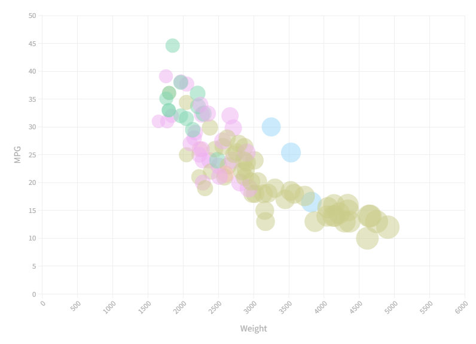

# 02-DataVis-5ways

## D3

The implementation was modified from an example of basic scatter plot online: https://www.d3-graph-gallery.com/graph/scatter_basic.html. It was particularly easy based on previous experience with D3 for changing colors, opacity and all other attributes of the dots. However, finding the correct way to represent x and y axis was very difficult especially with adding ticks. This tool is definitely the one with most customization. 

## Flourish

This plot is easy because Flourish provides abundant API for creating plots and sizing as well as coloring. It is the easiest version of all scatterplots in the assignment. No difficulty at all. This is definitely a good tool for business users. However, it is not possible to export an html page with a free account only with premium account.

## Matplotlib

With previous experience in Python and Matplotlib as well as pandas, this creation was also straight forward and easy to deal with. It is definitely easy for people doing Machine Learning to plot out data before making models. The result is as the following:

## R-ggplot

This is a quick and easy plot with ggplot and R. It takes almost no arguments and offers a quick knit to html. This is a good source for academia to creat plot.

## Tableau

This is like Flourish, but it looks at the data aggregation directly, making it more difficult to use than Flourish. But this is also a very good choice for business users.

## VegaLite

This tool is more like D3 but using a json type of writing. It is definitely great for creating static graph, not very sure about it with animations or transitions. The apis are straight and quick to use. 

## Technical Achievements
- **Generate Scatter Plot**: Created scatter plot based on requirements. 

### Design Achievements
- **Good Color Scheme**: All of the colors in different graphs are aligned in the same color scheme.
