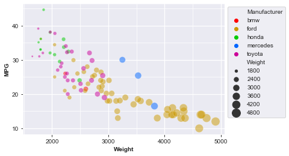
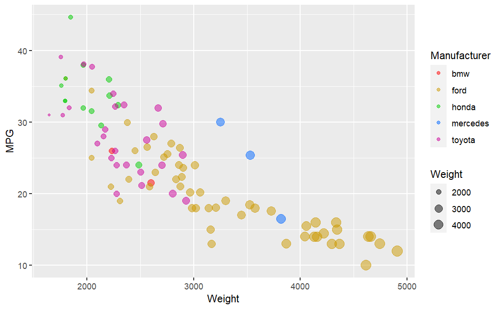
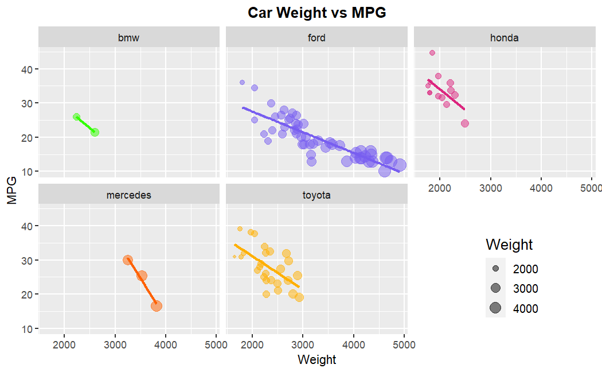
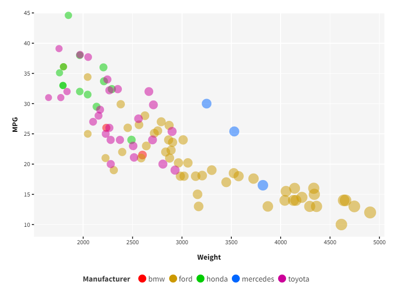
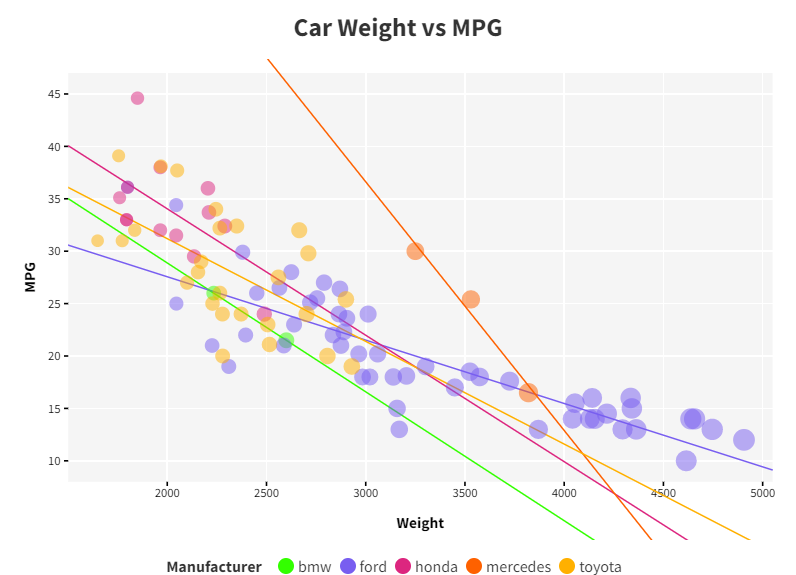
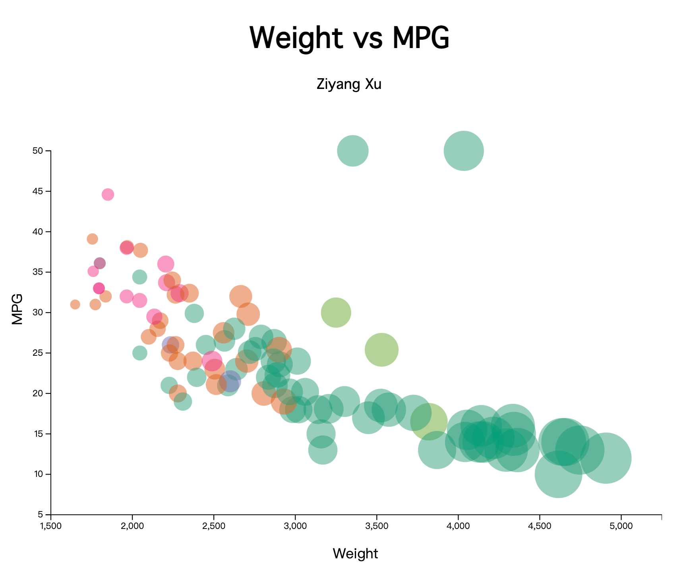

# 02-DataVis-5ways

# Assignment 2 - Data Visualization, 5 Ways  

#Jules Cazaubiel
===

# Excel

# Seaborn (Python)

# ggplot2 (R)

# Flourish

# D3

Readme Requirements
---

A good readme with screenshots and structured documentation is required for this project. 
It should be possible to scroll through your readme to get an overview of all the tools and visualizations you produced.

- Each visualization should start with a top-level heading (e.g. `# d3`)
- Each visualization should include a screenshot. Put these in an `img` folder and link through the readme (markdown command: ``.
- Write a paragraph for each visualization tool you use. What was easy? Difficult? Where could you see the tool being useful in the future? Did you have to use any hacks or data manipulation to get the right chart?

Other Requirements
---

0. Your code should be forked from the GitHub repo.
1. Place available code, Excel sheets, etcetera in a named folder. For example, `r-ggplot, matlab, mathematica, excel` and so on.
2. Your writeup (readme.md in the repo) should also contain the following:

- Description of the Technical achievements you attempted with this visualization.
  - Some ideas include interaction, such as mousing over to see more detail about the point selected.
- Description of the Design achievements you attempted with this visualization.
  - Some ideas include consistent color choice, font choice, element size (e.g. the size of the circles).

GitHub Details
---

- Fork the GitHub Repository. You now have a copy associated with your username.
- Make changes to fulfill the project requirements. 
- To submit, make a [Pull Request](https://help.github.com/articles/using-pull-requests/) on the original repository.

Grading
---

Grades on a 120 point scale. 
24 points will be based on your Technical and Design achievements, as explained in your readme. 

Make sure you include the files necessary to reproduce your plots.
You should structure these in folders if helpful.
We will choose some at random to run and test.

**NOTE: THE BELOW IS A SAMPLE ENTRY TO GET YOU STARTED ON YOUR README. YOU MAY DELETE THE ABOVE.**

# R + ggplot2 + R Markdown

R is a language primarily focused on statistical computing.
ggplot2 is a popular library for charting in R.
R Markdown is a document format that compiles to HTML or PDF and allows you to include the output of R code directly in the document.

To visualized the cars dataset, I made use of ggplot2's `geom_point()` layer, with aesthetics functions for the color and size.

While it takes time to find the correct documentation, these functions made the effort creating this chart minimal.

# d3...

(And so on...)

## Technical Achievements
- **Proved P=NP**: Using a combination of...
- **Solved AI Forever**: ...

### Design Achievements
- **Re-vamped Apple's Design Philosophy**: As demonstrated in my colorscheme...
