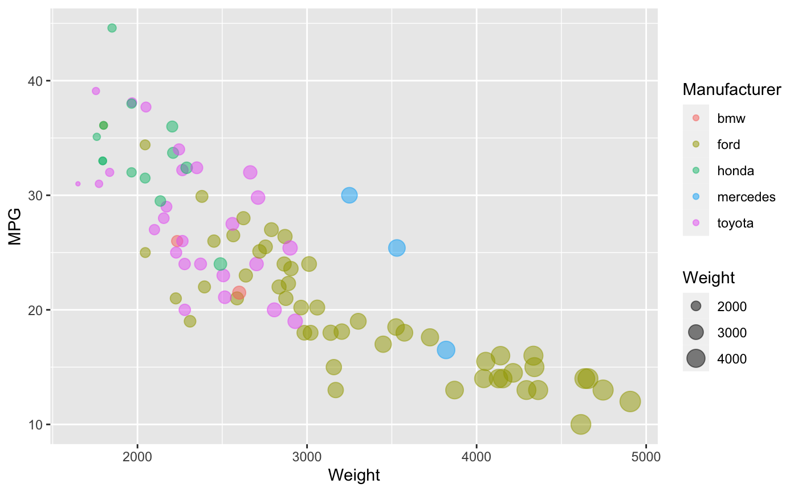
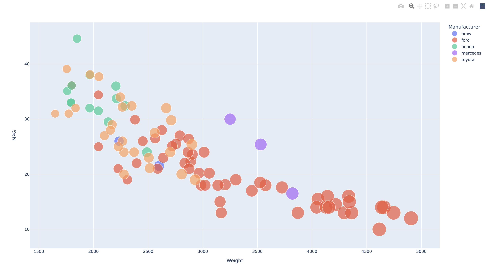
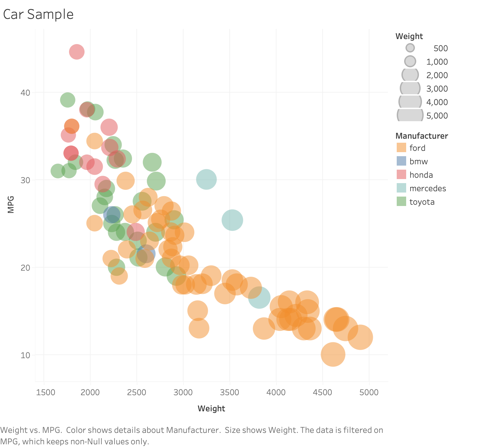

# 02-DataVis-5ways

Assignment 2 - Data Visualization, 5 Ways  
===

# R + ggplot2 + R Markdown

R is a language primarily focused on statistical computing.
ggplot2 is a popular library for charting in R.
R Markdown is a document format that compiles to HTML or PDF and allows you to include the output of R code directly in the document.

While it takes time to find the correct documentation, these functions made the effort creating this chart minimal.

# d3
D3 is a javascript library used for adding designs, creating plots and animating webpages trough html. I think this one was the most complex graph out of all of them, and it requiered the most lines of code. 

# Python + plotly
This python library provides the necesary tools for creating graphs in a few lines of code, but i found that is not very versatile and it those not allow you to change the structure of the graphs much, that is why I was not able to add the legen for the dot sizes. 

# Tableau 
Tableu is very versatile and it allows you to make very complex graphs. the only difficulty is that it contatins lots of functionality which can be a little bit overewhelming. 

## Technical Achievements
- **Proved P=NP**: Using a combination of...
- **Solved AI Forever**: ...

### Design Achievements
- **Re-vamped Apple's Design Philosophy**: As demonstrated in my colorscheme...
