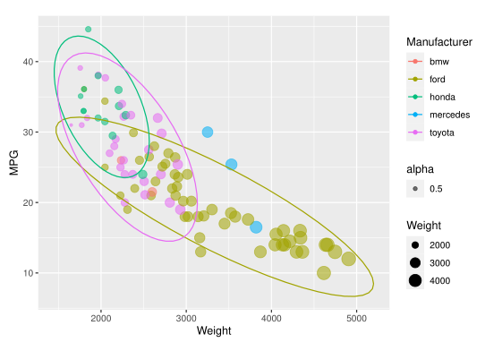
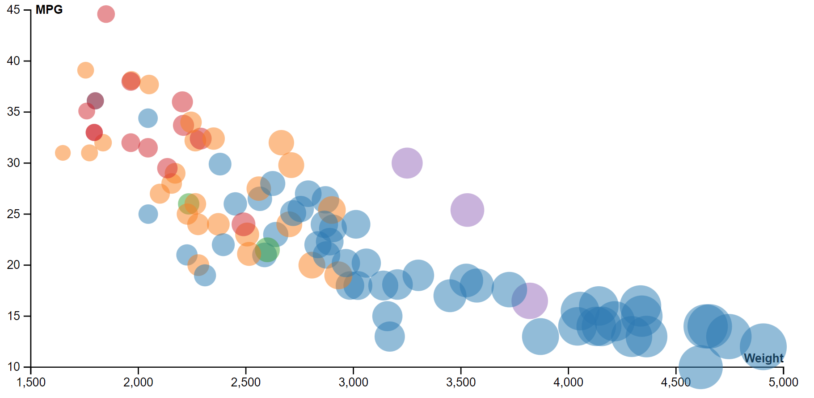
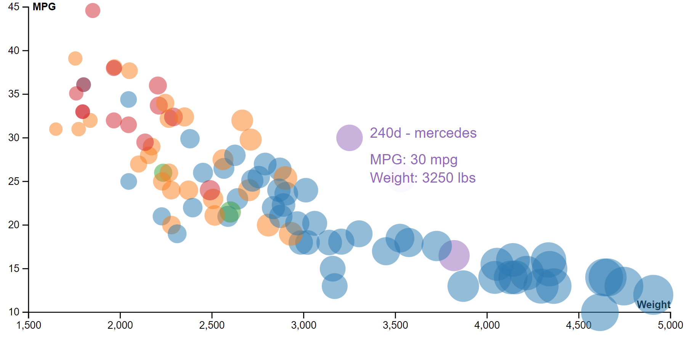
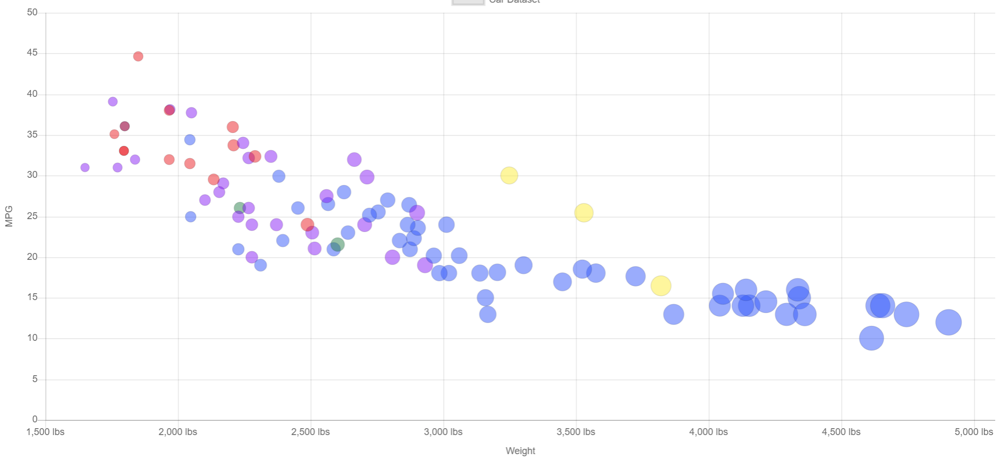
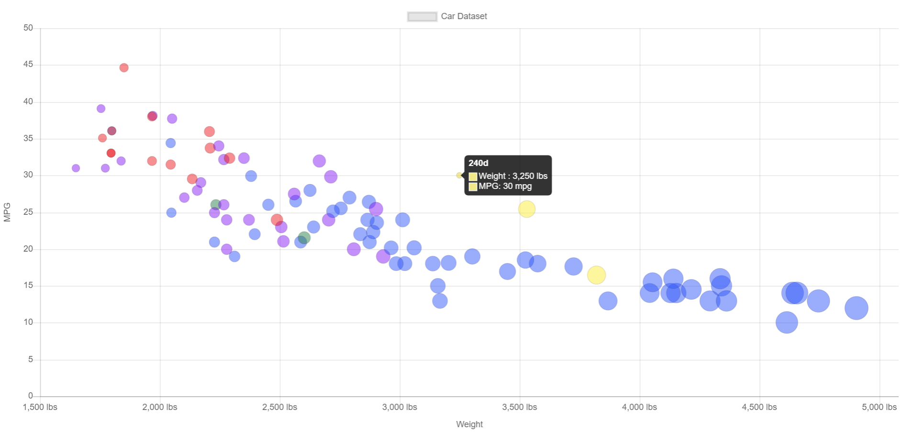
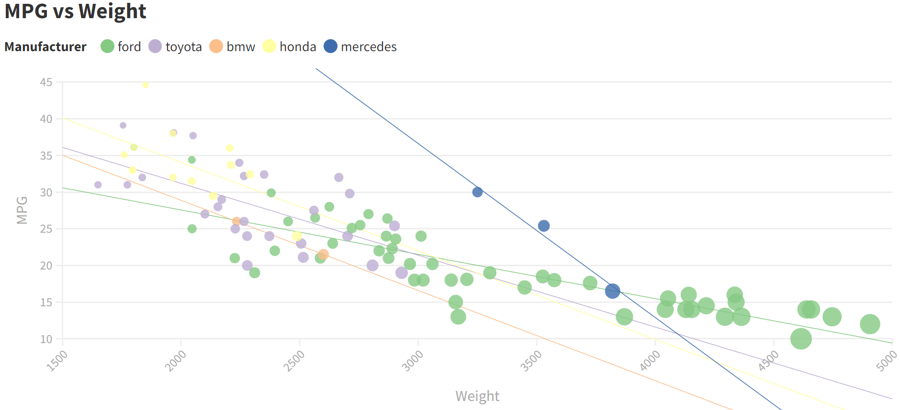
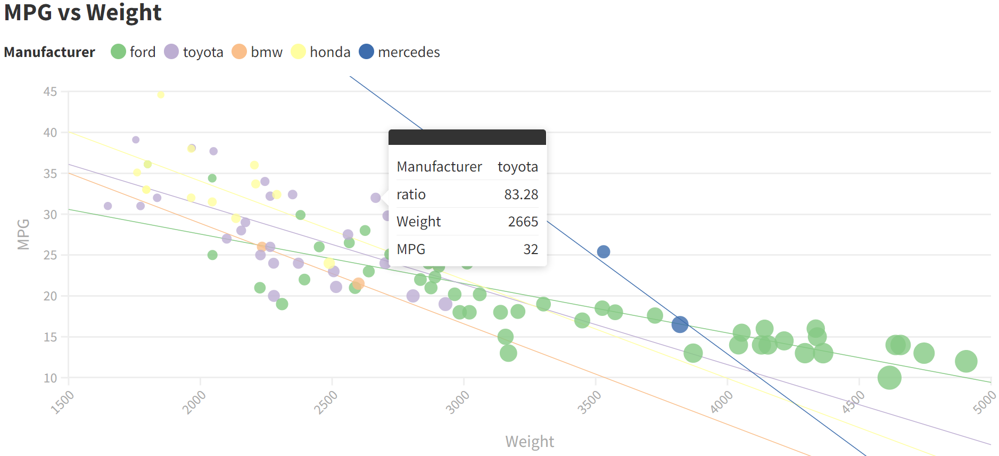
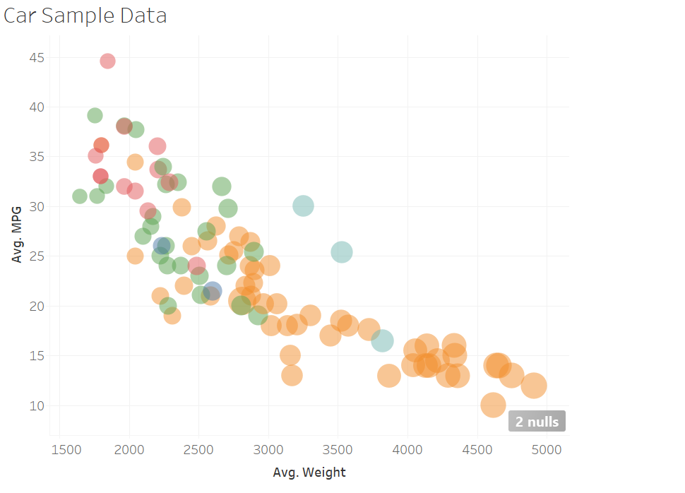

Assignment 2 - Data Visualization, 5 Ways  
===

Libraries used:
---
- d3.js (code available in index.html)
- chart.js (code available in index.html)
- R w/ ggplot (code available in r-ggplot.r)
- Flourish
- Tableau

# R + ggplot2 + R Markdown

R is a language primarily focused on statistical computing.
ggplot2 is a popular library for charting in R.
R Markdown is a document format that compiles to HTML or PDF and allows you to include the output of R code directly in the document.

To visualized the cars dataset, I made use of ggplot2's `geom_point()` layer, with aesthetics functions to map the color to the car manufacturer and size to the cars weight. Additionally I used the `stat_ellipse()` layer to add ellipses over each manufacturer to get a better view of the area they take up. Note this function did not work for two of the manufacturers as there were not enough data points to create an ellipse. 

Recreating the given graph was relativly simple as I believe the sample was created using the same methods.

# d3 + JavaScript

d3 is a visualization program utilized with JavaScript in web development.

Again I initially started by trying to recreate the initial graph using d3.js. By extracting the data using `d3.csv` and drawing a circle at the scaled x and y location on the graph a basic scatter plot was made. Then utilizing `d3.axisBottom()` and `d3.axisLeft()` I created some basic axis for the visualization. To add a little more interactivity to the scatterplot I created a transformation the moved the point from the upper left of the graph to their spots on load. Additionally I added a tool tip on mouseover so a little box would come up with Meta data including the car name, manufacturer, MPG and weight. This task was not overly difficult with the right libraries and my JavaScript background, but very useful for reading the plot and is something I would likely implement into more visualizations. 

Play with here: https://valley-invited-bismuth.glitch.me/

# Chart.js

Chart.js is a visualization program utilized with JavaScript in web development, I stumbled across it when I was intitally looking for p5.js information.

Again I initially started by trying to recreate the initial graph using chart.js. By creating a canvas on the HTML page and assigning it to the type Chart using options I was able to select a scatterplot option and fill it using the cars data. Additionally in options I was able to manipulate the axis sizes and other features. While I could not find an easy way to map color or size to manufacturer or weight respectivly, I did find that I could set them to an array of values so I created a function to loop through the data and create an array of colors and sizes derived from those values. Additionaly after looking at more documentation I found that it too was easy to add mouseover tooltip to provide more meta data for each of the points. I had difficulties trying to create a legend for the colors and sizes because those were done outside the chart.
 

Play with here: https://valley-invited-bismuth.glitch.me/

# Flourish

Flourish is an online chart program.

I found Flourish a relativly easy program to work with when creating a scatterplot from the cars dataset. Coloring data by manufacturers and sizing circles by weight was done with ease. Additionally Flourish provided the interactive tooltip built into the scatterplot and nothing extra was needed for it. To add a little more to the plot I added trendlines for each of the manufacturers to provide easier analysis. 
 

# Tableau

Tableau is a chart maker program.

Unlike Flourish I found Tableau clunky and as easy to work with. The initial scatterplot that was made had lots of errors as it was combining points with the same car name rather than just treating each row individually so it created an incorrect plot. After some tweaking the values and utilizing car and year as identifiers I seperated the points but it was still creating the values as a function of the data. Overall I was able to manipulate the size of the points and colors to have a relation with manufacturer and weight, but I did not enjoy using the program.
 

## Technical Achievements
- D3 point transformation 
- D3 tooltip on data hover
- Chart.js function for manufacturer color and point size
- Chart.js tool tips

### Design Achievements
- r + ggplot stat_ellipse
- Flourish trendlines
