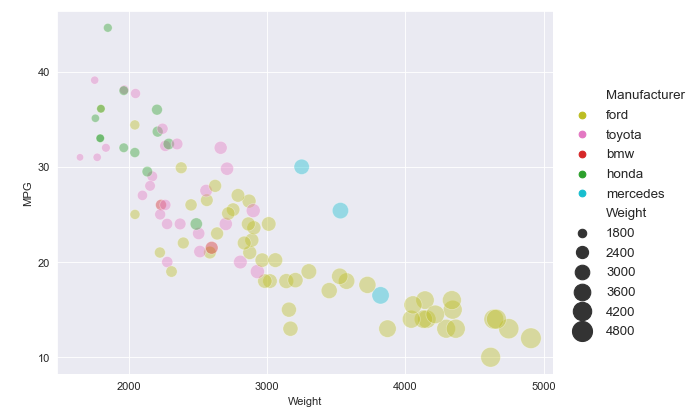
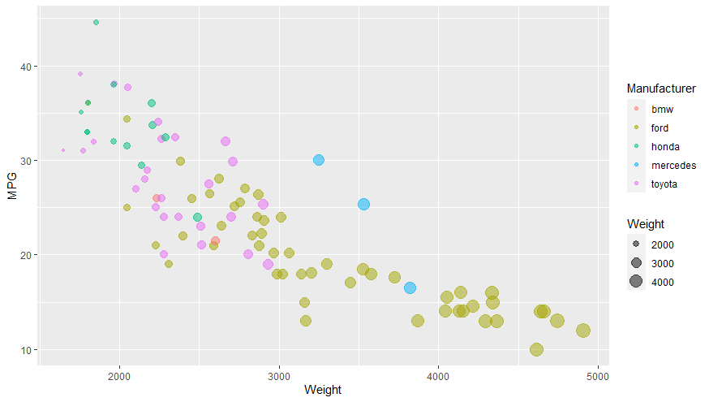
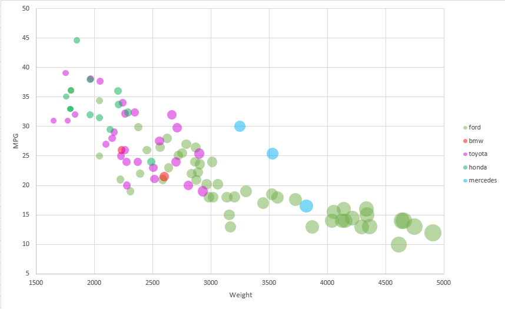
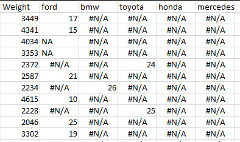
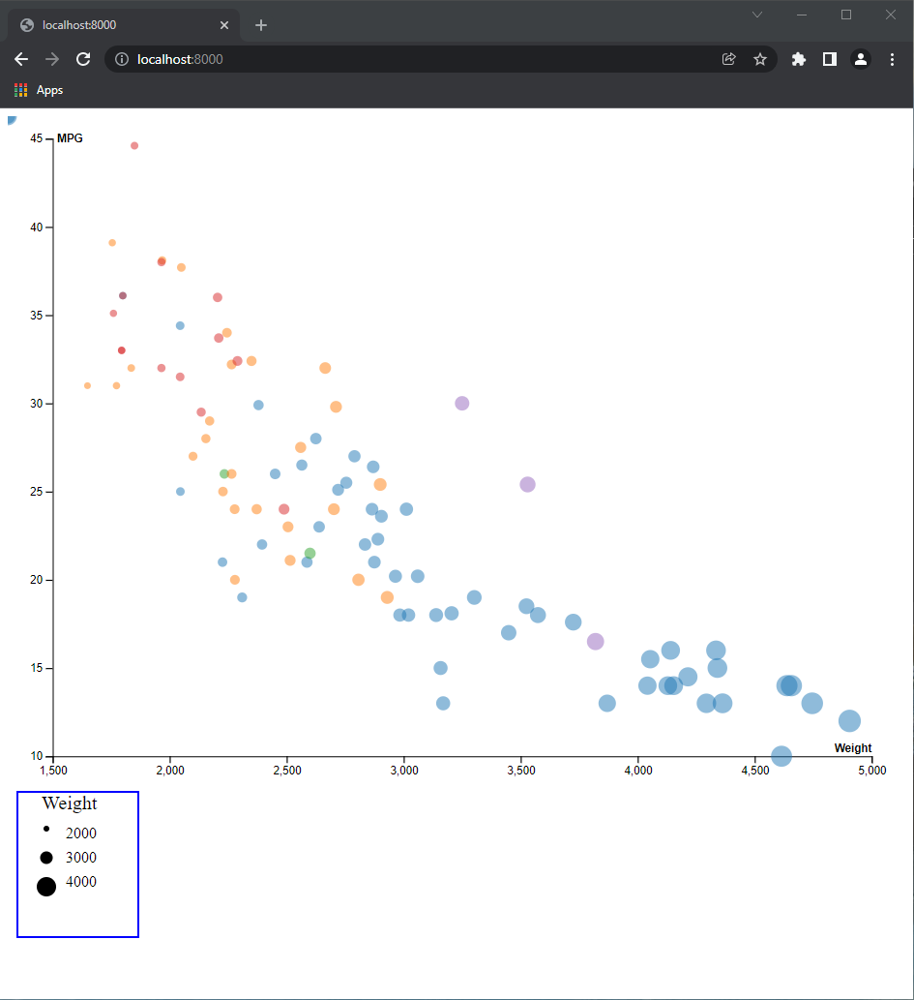
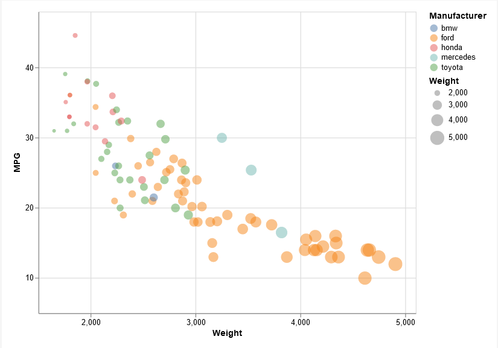

# 02-DataVis-5ways

Assignment 2 - Data Visualization, 5 Ways  
===

Your goal is to use 5 different tools to make the following chart:

These features should be preserved as much as possible in your replication:

- Data positioning: it should be a downward-trending scatterplot as shown.  Weight should be on the x-axis and MPG on the y-axis.
- Scales: Note the scales do not start at 0.
- Axis ticks and labels: both axes are labeled and there are tick marks at 10, 20, 30, etcetera.
- Color mapping to Manufacturer.
- Size mapping to Weight.
- Opacity of circles set to 0.5 or 50%.

Other features are not required. This includes:

- The background grid.
- The legends.

- Description of the Technical achievements you attempted with this visualization.
  - Some ideas include interaction, such as mousing over to see more detail about the point selected.
- Description of the Design achievements you attempted with this visualization.
  - Some ideas include consistent color choice, font choice, element size (e.g. the size of the circles).

============================================================================================

# Python + Jupyter + Matplotlib + Seaborn

(Language)

Python is a high level general pupose language. It has many different packages for data visualization. Few of the popular ones are Matplotlib and Seaborn. Matplotlib allows making of almost all kinds of graphs with very basic graphics. Seaborn is built on top of Matplotlib and allows advanced graphics and better themes.

Jupyter is a web-based interactive environment for creating notebooks in Python. I have used Python inside a Jupyter notebook.

Following are the steps that were followed: 
1. Import libraries like Pandas and Numpy to import and manipulate data. Matplotlib and Seaborn are visualization libraries which are also imported.
2. The csv was imported into the notebook as a pandas dataframe object.
3. A plot was created of the appropriate size. 
4. The grid in the background was matched just like in the provided chart.
5. Parameters were passed into the scatterplot function which are explained as follows:
    - x : X variable
    - y : Y variable
    - hue: Color variable for the markers
    - Size: Size variable for the markers
    - Palette: Colors were passed to match the exact colors in the provided chart
    - Alpha: Transparency (set to 0.4 instead of 0.5 intentionally to match provided chart)
    - Data: Source DataFrame
    - Size_norm: Domain of the size variable
    - Sizes: Range of the sizes on graph
    - Legend: Brief legend
6. The next function is to position the legend in the position in the provided chart
7. The xticks and yticks were passed to mark the same ticks as in the provided chart
8. The result was then displayed

Data Manipulation:
- As such no data manipulation was required.

Advantages: 
- Matplotlib and Seaborn allow us to craete visualizations in very few lines of code.

Disadvanatages: 
- Editing the legend is a little more complicated.

Future Scope:
- Although not a very high level of customization is possible, since data manipulation is really easy because of libraries like Pandas, this method will always remain popular.

# R + ggplot2

(Language)

R is a language and environment for statistical computing and graphics. ggplot2 one of the most popular and an open-source data visualization package for the statistical programming language R. Tidyverse is a collection of open source packages in R for tidy data.

Following are the steps that were followed: 
1. Import libraries ggplot2 and tidyverse.
2. The csv was imported into the script as a dataframe object.
3. A plot was initialized. 
4. ggplot2's geom_point() layer was used along with aesthetics functions to match the color and size.

Data Manipulation:
- No data manipulation was required.

Advantages:
- Minimal code
- The visualization matches the original chart exactly probably because the original chart was also created in R

Disadvantages:
- Takes time to find relevant documentation

Future Scope: 
- Since R allows a lot of other statistical analysis, R will always remain popular among data scientists. 

# Excel

(Tool)

Excel is a spreadsheet tool which features calculation capabilties along with graphing tools. It allows users to use many functions for data manipulation.

Following are the steps that were followed: 
1. The csv was first converted into an excel format of xlsx because csv files although read into excel, do not allow graphing. 
2. The csv was imported into the script as a dataframe object.
3. Bubble chart was used to make the chart in excel.
4. For achieving the color scheme, the data had to be converted into a different format as shown:

5. Bubble plot function was then used with these different series being used as the values 
6. To match the color values, colors were selected manually for each series. 
7. The ticks were then edited. But not a very high level of customization was available there. Only the min and max values could be set, not the intervals between two ticks.
8. The legend worked for the colors, but there was again no option to edit legend to show the sizes of the circles.

Data Manipulation:
- Data had to be converted to allow the colors to be selected differently by manufacturer.

Advantages:
- No coding involved and is easy for people with all backgrounds.
- Once the data manipulation is done, colors can be manually selected for the different manufacturers.

Disadvantages:
- Selecting the data to plot on the chart was a little difficult
- Extra Data Manipulation is required
- Legends can not be edited to allow us to plot sizes 

Future Scope: 
- Even though Excel does not allow a very high level of customization, it is very simple to use and hence it will always remain a favourite.
- Power BI is already built on top of excel and allows more customization which might become the future.

# D3

(Language)

D3 is a javascript library for manipulating documents based on data. It helps create powerful visualizations.

Following are the steps that were followed: 
1. 2 svg elements were created, 1 for the graph and 1 for the legend.
2. Some values were initialized by creating arrays.
3. Function was created to build the scatter plot which included size and color variables as well. 
4. Then the axes were built in the function.
5. Legend was tried to be recreated in the position next to the graph as in the provided chart. It was found to be difficult.
6. The legend only contains the size variable and not the color variable.
 
Data Manipulation:
- No data manipulation was required.

Advantages:
- D3 allows more level of customization. 

Disadvantages:
- Difficult to debug the code
- It was difficult to position the legend next to the graph. 

Future Scope: 
- D3 allows us a very high level of customization and hence d3 has its advantages. But the user friendly nature of the other tools/languages may cause people to switch to the other tools instead. 

# Vega-lite

(Language)

Vega-Lite is a high-level grammar of interactive graphics. It provides a concise, declarative JSON syntax to create an expressive range of visualizations for data analysis and presentation. I have used the online vega environment for this and the code can also be accessed by [this link](https://vega.github.io/editor/#/url/vega-lite/N4Ig7glgJgLgFiAXAVgAyoDQjgUwgczhiQBZ0sAHAQwCcqBbAZyQG1QA7BnJEANwhxgQWRjgA2OAMbFEICOxg4avKmOEgARvKg9Gk1TmYBfALpYoVGFSSgVYgK6HWoJMiwBhWjxgB7GvJ91AFkqdnsAMyppexolHnC-HSwggAUAcSQARgB2DwBPMW0lZkQADiwAEQhGCjEonHocBSQAZlQAJiwACT9RCh8wOMRMsiwAdTxCGRaSEgBOLABBSUlxJUsIH3Ys1AA6NxAgnyhxXYBNHC9EbMwQAHl-fHkeRcb-fW2jDBdEADYPK4gfCqKgADwEAAI0KhgqEIlEYDEhiAEjQkod0lkDu4CkUaCVyiAqjU6qtGs1ECR2gsQD18Th+oMaFk5oSJgQiKQZpklis1nQYJttsNbkcTmJzpdmddbg8CM9ZK8lBAPiAvj9Mi0AdKQL5-OwfBCABSMMAASlhYUi0ViOtR6NSGVkADlFuocYV2Cd8UhCcTavVydNkDzab0GQMhplkFqQOypqRUDNeasJAKhVlQ2LThcrjcsHKnsKQEr3qE1d8QFlCZ4dfR7IwrOx8BCND5GIwIW12pb4TbkfbgpiXW78p7vQTKtUA2SmtMOt1w4yo6M45NOYgWi0Yyn+Rstr7kscc1KkPn7o8FSW3iry+qq4h2qHazxJH4tlQIfRaABrCEQCBe2tRFbW8Hw8h8KwhyddoSDHPESjgolp1JBo50zWM6T6SNpTmA54w3doWmyToSz5NN92FaMj3FSU81lS9iwAKSoah2EMbh7yQWDtR4b9eGVSQfyAhEkTtRJoO459cS9YokH+ZCSUDdDH3IMN6WXaVSnw9cZHaZBSlyMjU3WQUD2GBTswlXNpXPQsr1LW9PkrVpbhfVSF0OOFgLEngNHoIRkmHdoFI9BDSCnJTZwpTIn0XDScIw8ZdO4oikOWEz03M2L9hok96ILRieAAURiHwKEuZyfhaUj3JRfSYWSbzRNA2RByCp1MjcmSJ0PRSZzQikWl+W4sIjJkpJ0jkZBIX5qOMvczKopCrLo2yGPlYtHNVLjNxrQE3xoD8RP7HVfAgqCOu47EerkylIoGoMkvU7CJsQPDkum1L2kJDLFozYYVuPazT2uUN7OY1jQg4itqppOqKHkXwTpAgcJKux8bvHO6kP9VCnvewkxs0nhXXUAi9NQWbdwopaWTykG83BorFRvHaXMpJC6r1AIoXQFHfLa9GMU6+Hbp9P4HvxlSGvi16hlKNkUs3bsadMgHo1yw5gbWs9mc2l42bvDmSH2nVgTqcEcD5xqvKtFq0bRSTAfg2SJb9FDlKGkM5fGqMdzXL7KWjdLyPV7KWi11abL1wqDdZwTjZ+H2QDqt97AUGg8ghRgAEd7AgWJjVNC0mvt074mFx0sljMK3cnfrpYpMhRqXRLhnPCnSGyamFtpjXSOj0Hsn1otDcTqqH2QULAXrRtQnwAXWpRKvh0yGtxZKBS8a9vS0F9kmyiVoOWk1Gk-v77KSCjnWY7BuOx4TstJ-k58DvfMQ6ghWL+bLvtUbOuBSC1gMan1dr1e6jdd6xxen7aUvwpoJg7tkWMF9w5URpEPJmD8rwsTYjDXaCDeKyEOh+CEcBaCwHKkvZE51gHOx4qnTeEUoHRRkJkTUB924fUDkg9o7Rsi-TDllKiyAb60TviRHBkN8GiFhg+X48NASIwUIaGgGcqBtnsMQP+Pll7tRFlJcBOMpbQOGPwrhb1SgKS7o+fhCk0EiKyL8cR+VbKkQhuPZ+8izy10BBbMEkJoQ0PEk7DGIxjHu1MWw1oKdibt2jLGWxJBYrn2EZRGuDNdbXA8Sza8E8fFlFqv4ug7AIQ8wNMXc0ITK5hMMcMWuzCyjRMGvOUi8S3ojFuMk6kodMoZIslkyRuT475O8btRWxCQAqN8FU0udt-6CxXnU6udjImIRaQTWK7S25WJscrIiPDHEDMyJZW+w8RmPzGU5Qpcw3LvyOpwL8v5-wQDmTU2QdDLr1KIuslhO8YnmNbglN6cwjK2Iag49JdNAauMZu46RPA8HQzkbtOYxSdSkM-p+U56B3m6IdoAi6ICflGTrhA3GntAVgssQrY+fCuq3GOTC05cLslSIvKM5F7FUUczmDPc2pTyl+ACB85ZDo15cyaR7KKrTXI7JBVGYin0kFkCpGrJxsKDhYNsrGTxT8bm7UZVMsQMAHTNQrkLFZa9GnYyiawuVm44m7P9vSjcJBhqoOhRrWMOrfGIoNezDUqAzZ8SoAJd4wkCWWvFc7defzJYOoJrLWBh9Jm8I3N2UMzKNYuO1ecvMeq8nbSTg+DhGLXw+AzjALOYqDGrNigmmVj0VIt1pdKU54LlbzFQFC-pLL2hsskUW0ZJaX7DFOVM-Q+oSUhHLgAsCxKGHdTtRspNKkaWpvbumiFAi0n9o1pggtuqA0gG5QQjmP8pkzMCNGhdVqJWiwTZS2VWyLFbqsYgwip8mXeuyqUIdw8R1XLHYUzUb86wvIAmKr5s7gorvComgFjrowKQ6VGd9ELSioCMjmiOgHC2nvPbyjUyZU6z3DYJKNCy9GO0fUYphq75KbJlmpdDOoyYqsIoZA4eGqJGT9dcJC+rrlBrLS0UNsgb11tXjBUKTSX0tpiu+9jvpukHJICnPjziCO2WE8Wo246z5To-l-H+ts52LOXrB52NVn0sYpCPdt8kv3sNKMNDVAy4rawkcPfTXKoY8s4pe2YUz8BCoqbemjhLan0cGYxxDzam5tOc4DdTQcUkpM8yyoGvm8z+ZA4ZsDJAyUlNCMK-UhoTTVLvUs+tkqm0OZSx+lc6XVW-Ak9l3NQy-OntA0a5AFaSHvk4DBoB3zVlgIS-Xf5VLHXZDQy66Ug2uPsN+PMLr2U809fy0RwLF6NTIFK5iiA-BJBirgFsCwDCpVMcgcht9wL5a4S7UHWCpR93-WyvmvLem9uyOCxqDrUz+JUZk9azqWNEPbzm8m-eLWEUZumNGIRB7spzF02eA4In+uXt+MdngprzXzrq7JrIt3EtNdiaGVTgM3UzQQbhv9VFI4-bcVjvrRWjU9xBw2JsLZoO1f0WThpjX11DU8rT1Jq3WinM+5fKig9j0c85YVgp3PsQPJ8NisbS6MbUns+LmQm7afZFc1JJzfd0HOJ27ZbHeTiOA7LQt69SMouWdo6EuLvzpsUqp2l1L7mZePg6-L63Hdbcq5x1zy92QlGYpG7Oi197dTjbgzBCnM37uw5UpqJCtP+XB4EZ5bTDTMfXHtwFgHYHShDemW78HcX42+7ujD19ufLcF9e3w1kfSvvLXL2bzn6vL0fanadlUEJJC8BWBdq76fWi2sQ4p5LSA5g06W64JJyschHOZ1kbIg-K9XMd2B1kYWIsioNI3uN18odZ6S2Y7cG-FUdpW0j0gT5eP7-MbsQkgmXdVcHIY8fh2hUAIMw0I0VRqMPcYsH0bsE028lNKYns4FfRQxbE2hG0rdNUchdgzlfszwFJo8R9QDe1x8zs58vQF8VZDcHsN0X9nst9g9d9v80d+Ndhct2drhiCHd9sSMHwwDJMgRSkqALAIRCAIAk8SdhcIdqxED-cU1Td6dYkeccCvMsxlceDh9xkOYnw-EE8jodchdaE08GEN47sV8zETdN8K8i9ow2D+8dMuD4UiD-sUUncpIuZlEG8TCvcGFtsW8JYrDAUulUsOUIVp5HCFca58DI9tCgCtoQDBDm86pvwaA-xBdosY0bNwkxY7skDV9hhp5UsuoVDHw5g2hNtRFB9eCq8PDCknx48eAfpUBmA-C+IlBVgTh2j6lWV78IFCizFTkiZbCr0P89owDqidMBMtDACRNSojoKpS1voplwgyib9wkl8H9-dVYEca42tM1DJf12CsR4j5iDNSDBDGE6oohDooAp8Z9zsOjZBLtqDbNMgtZyUTEjc19RjX95JyiwDNNpjhgAM2dXDrgjIRNT9doiIBUeBwtQgxDpCrM6M41wSFDfjMZUDD5z8Jjtx9JQTMgj1CCoSdDDU9DVxuY4AM5vQtAVlk9Sc5D4tvj7V6DvZGC0DAYaRkktxojw8RhB9oTLjdDQCPUTMjCv5ChwgYANAogYCmTrMzD9d5NLD-cbCAS7CJj7EBTcCAMlcyTsgRT6igtGjQtyM6w+cF5XkIR2gABqHsF42NfXMRAYn4jk9hVcWnMfHUs3PUk5MRf-OYk0tXMUwQ+HOqGqVAQCZ0-yQKH5T4904I-3WKLkw+DhQ4vSEaE4pw3-YMo00Mq8RY8qSqRogOOqcIAQeeTY+pYaXYaSdU7E-E2nX4fZIOdeNSUvIUlw9lQkEg8M66BEkhCfSQR42fZ0t467UBFxRs5fDU9M9uEaFg7DXMmIiyTg84-svg6vOE34OvSIQuegLYGAY0KgbRHweZWAmNerGCPYWqJpIYwFMA3E7dc3CoohdQllIMrciksTbiYHS0+IKgI8k840b8dgK8pU9E10hsugnPGKb02wndA5EiNcwUsRXsyRbc0dZI7iDlSs7RGIVEz3WLDEuCoIhuT0+VUoloXk5WaMgMllT4w07gwRP8lYx8IfIC4bR5EiuA1PPXUlL4hTVMsjAvd8-SZcr8jWa+ViyE9ixIpFfgzwri4Q1MW8CQ08mUuUhU3XehfXT4ucrPEIlDcS2wnhSI+abs6+AstinCk-FSxowyKZO4xICEMQUEKg6cn5DHZMtdaiwmVLX4IEzUJi3NOInzey9ws0uEu5NYkCmgY8hQCEEgWs1ZfhXYbYv3bEsI-Yo+IvD7dC3Aw-X1OYmkAcyk0AuYbwnUInDy0ICwewdKteQ-NUynbEvYqXA3AkkicK-DLC4eCq0UqqwQ-EtOKtTObOPOAuIuarKCmQmCvot0sXQK5-Uo9VCYsgZAPvdcoUsqo04a3Cq41yTXHUNoVAYnNEusLonAHohhTChNA4QK9eTCWw404PbcKomS8yMAiigAo6q5Es5Y8dU+dS0zT8RQGgVMfSibYcCTCitkgKhCmQX01srMlkEK4kgDOyyE7DGKg7B8GqA8xK5KnRbIlPW8gCzcyi2bdvRC18qxIE447G-6rQ-GpSwNTimqYckAUhJ5HS+UoSWGmg6kP-eC+m9hcyrU+Kv0jhYklaqKvGjaRy3cjmGqZo3i7XOoEW2zQdB8psl6kNcIySkKfqmo+S7JDmmEpy3aLcXm2CS6sVN4bopwUBBDEy1M3uVs7vTNFNUvJ8cWpWq2lW4ssqEGwpLcAnEcs7b+aECQtQSc+fZ2WYSKpGum5AtfRct6fHFc+HbsyOXGkOgmgQ1oC0tI605sKfHwDQOgFqmCSOdqz23KpCrUkATjHUu5c28nLK+I62ka-8zcEEnikANyxkxanUKcmgmqGm9O7PSWnYIyU3UiXdWW7s2Ysk-u00wm6nKZeeGgCQcm68lPXIusjHYynKwKuPVLAyFg-04klxUk7g0oUeXBW29Wisg6Uc7+C67y6esRC+j0lG9A4KjGjuaS7s2cvu1+mRBou2kokeqGmG500+ybQ-MlUS7EtG2w-covVAfOn-PAg65+mB5StW6qZATWkAQwQ6U8kgBM4+5kuLGYWezBwKlsnBySqmbujcy2u+F+ji0G6SuqGhvwU89oBAZ0qmio3YfI+c5s-4pgv4SSiTYqrzPYDekhwRyOwChGWIBwE4P+2zSODBw24BkUJe9602rqYk6+Qaq4ARzms9d+6qdbSU7W-inIlUuswdTPS+8xsok2ovbcNRllFxIu-h0h2QWE9W88NOWIDsaATxk+7xjKx62mpDAJrG-KjhdsnvLswhwdAgrRpxmJ6qNQuqJEzgcQ-AROimph5dXYA26HRQtjZC8otoCBwhw-TQzeqJ0Tbm2vBK0ClK8IIiuuqRkXG4thgJ1upR9FQqz8yBmmwTIZpx3HOGe5HUMeq60i145OmciWzOixoJnUsAnhoUiEq2y5N+8hom9fdx4w+p5UoSybPxoBhekURR7kzuA5WCC5x+vum52B2K9WhZkeyQUcox0BCw+R9h7OoYXOiYkkpZwhq5-h4FshuBsFgw18b+o0c83wBa66ngKevWo5ooh5-KpF2xFFi5sRTRvGzF6Jlx+54QqplEjy+u1KLEwKoiBVJR8tQq7cWx3YRl657Ru2uYKhjS-QLS3W0BZp5ul6i0gvPJwiNsi5yOJ+plku1SsgOvOefnBO7lriil4YuZ7k6xIvOPUJjWMRYp3V9ZvCykfBqZUpfAOISZlkn6c10IqY-K6+nU-ci5gDR1iV519XEwL4EAdI4SRAUAGAPICqPF6GiQdQcqKICAJNpAPYZAGNpoN8KAeQReBNkALystqs8QHQWQLuLAJNlN2QfOUIQUKwQUASdQQJEoRN6AoIeQAAZUUAoB2HQBjb0AMBsBACgB8G-AVBYGjHIBDHQGjZjbyEnarbEBrcMXreTe4CbfsBbezY2A7awC7cncFCEj7fYEHYZB2DHf0HTbLendneFBYDcFNhXawDfDED8HXYEE3Z4EYdAh3cbZAANHoHkFUArBAEYAgAAC893QAN2t263dRd2eBm2FAj323uARAH3EOp2Z2QLX2F3MAl3UAV2jAjAgA)

Following are the steps that were followed: 
1. Data was first converted from csv into a json by using an online converter. 
2. Width, height were first specified. (Above the json data which is dumped after that)
3. Params was passed to make the graph interactive (Allows zoom in and out using scroller in the graph)
4. Data then includes the whole json file which was converted online.
5. In the last few lines of the code (scroll way down past the json data), mark was specified as a circle and opacity was set to 0.5.
6. Encoding allows us to specify the variables to plot and their types (quantitative/qualitative) on the different axes.
7. The color and size variables were also set there after scaling the sizes to the specified domain.

Data Manipulation:
- Data was converted from csv to json using online converter. (not much effort)

Advantages:
- Vega allows a very high level of customization. (I would say almost as much as D3 but without the complicated syntax)
- Debugging is easy 

Disadvantages:
- None as such

Future Scope: 
- With the level of customization and the ease of data parsing Vega allows, I certainly think this can be the future.

Many references were used for Vega lite because it was a new language for me. 
1. https://vega.github.io/vega-lite/examples/circle_bubble_health_income.html (For making the graph interactive)

## Technical Achievements
- Excel: 
  - Converted data into usable format for using the color variable.
- D3:
  - Tried replicating the legend. Although long way to go there, still a start.
- Vega-lite:
  - Did not know the language but tried following a few examples
  - Made it a little interactive by allowing scrolling zoom in and zoom out on the graph

## Design Achievements
- Python: 
  - Grid was matched just like in the provided chart
  - Colors were provided to the function to match the exact color scheme of the provided chart
  - Legend position was matched exactly (center right of the graph)
  - The ticks on the x axis and y axis are matched exactly 

- R: 
  - The graph matches exactly with the provided graph

