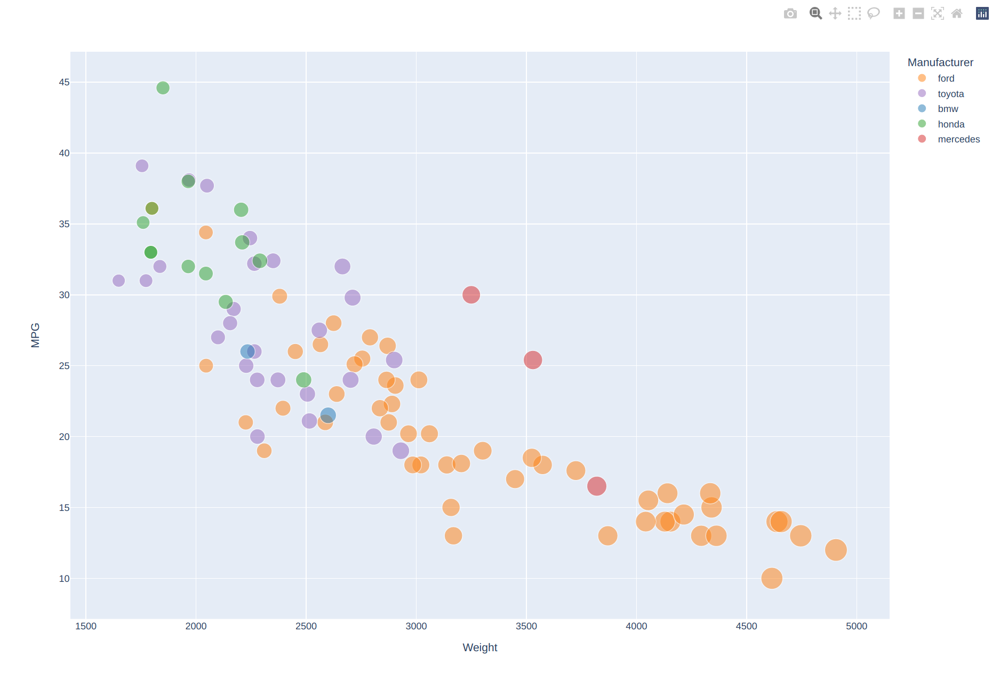
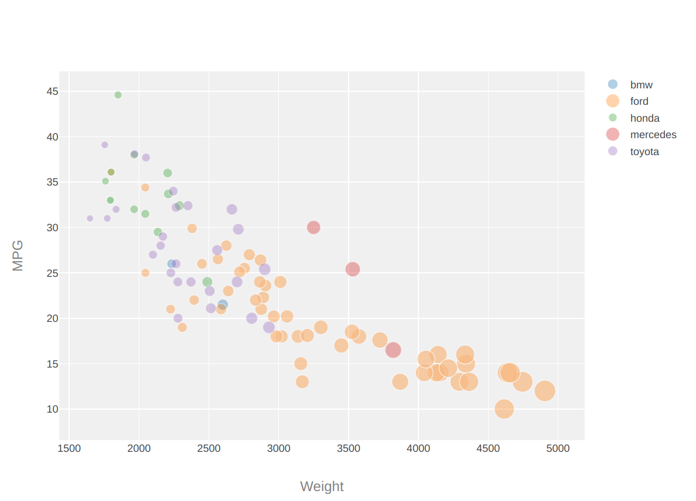
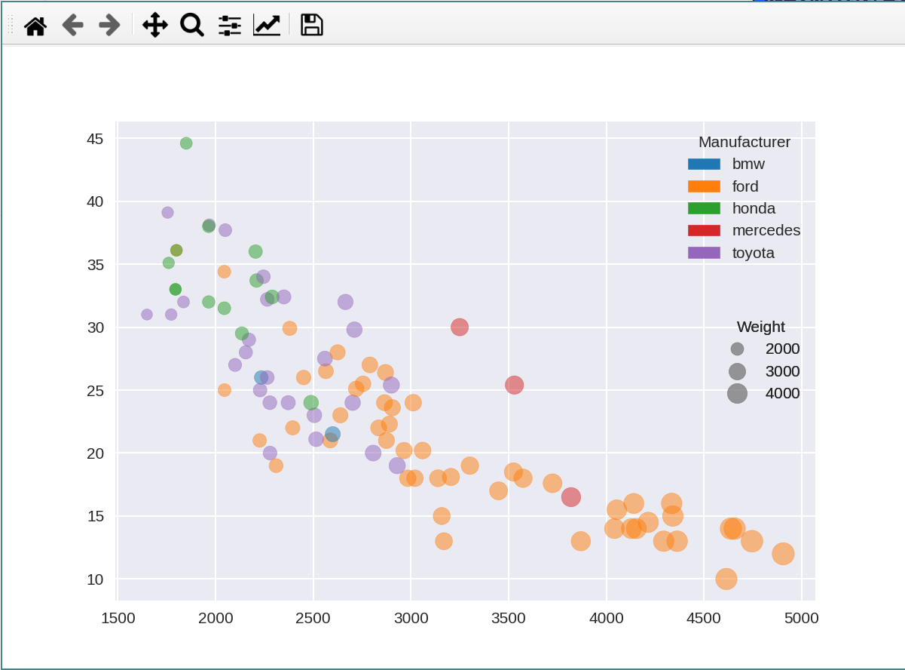
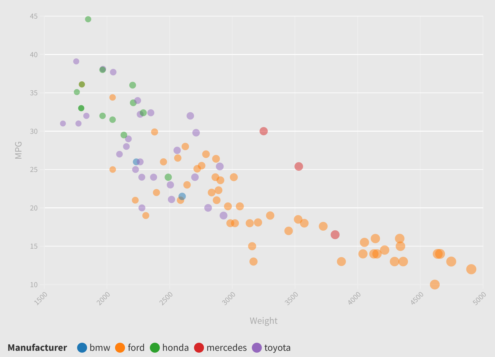
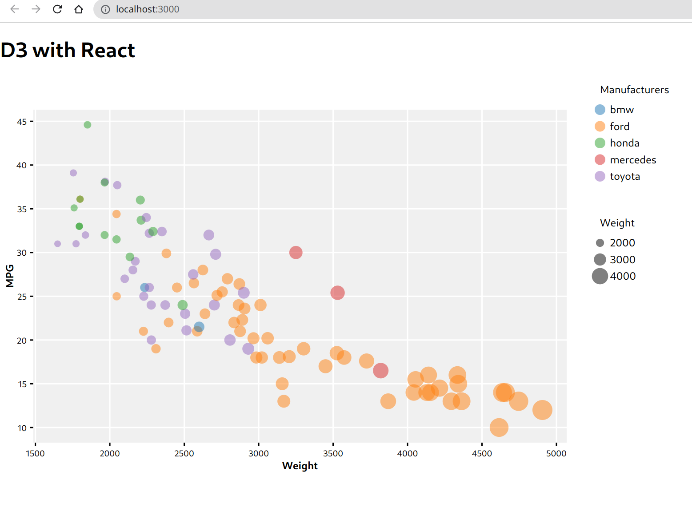

# 02-DataVis-5ways

Assignment 2 - Data Visualization, 5 Ways  
===

## 01 Python Plotly

Python is a popular programming language which is easy to use mainly because of the flexibility it provides. Plotly with python is relatively easy to use. It has an inbuilt function for scatter plot. So, we don't need to have much custom code to get the desired result. Currently, plotly does not allow multiple legends to be displayed at once. 

## 02 Javascript Plotly

Javascript is a popular language mostly used in website for dynamic contents. Plotly is a library for javascript for simple data visualizations. Plotly with javascript is comparatively difficult to implement than python-plotly. Mainly because we need to separate each category of data beforehand and then plot each group at once. Multiple legends, like in python plotly is not possible with the current version.

## 03 Python Matplotlib

Matplotlib is a visualization tool for python which allows creation of animated and interactive visualizations. Like plotly, it does not need much custom code to create a visualization like scatterplot. It has inbuilt method to do that called `scatter`. Creation of custom legends is possible but is difficult to implement.

## 04 Flourish

Flourish is an online tool for visualization. It is the easiest of all to implement since we don't need to write any code for it. To get a visualization, we can simply upload out data, select the columns for the axes, sizes and category. However, multiple legends cannot be created with flourish too.

Implementation: [Flourish](https://public.flourish.studio/visualisation/8644756/)

## 05 Javascript React D3

D3 is a powerful javascript library for visualization. Although we usually need to write a lot to get a desired visualization, the fact that we can tweak and create our own visualization makes this library really powerful. 

React is a javascript library for building interfaces. It helps to create interactive interfaces with ease.

I implemented this visualization with d3 on top of react. I wanted to try zooming in for focus of selected category of data. The animation part was difficult to implement.

## Technical Achievements
- Implemented d3 with react
- Repicating legends were thoughest. With matplotlib, I could not exactly replicat the legend but almost looks similar. In d3, it was properly done.
- Zoom to view animation: In d3 with react, I was able to integrate animation of scales.
- In all visualizations, manufactures are uniquely identified dynamically; manufacturers are not hard coded.

## Design Achievements
- All manufacturers were uniquely identified dynamically and colors were assigned based on d3 categorical swatches. All colors are consistent between manufacturers.
- Grids and axes were added in all visualizations as per the original design.
- (d3) For **context focus**, whenever we hover over a manufacturer, the entire scale shifts to focus on the marks of same manufacturer. And when we hover out, scales are reset to show all marks.
- (d3) Tooltip is displayed when we hover over a mark.

1. Dynamically identify unique manufactures. Manufacturers are not hard coded
2. Colorscheme d3 categorical swatches
3. Same color for each manufacturer in all viz by sorting via name
<!-- Targeting (eye movement) d3 -->
