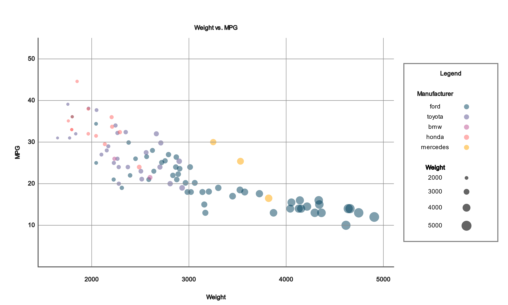
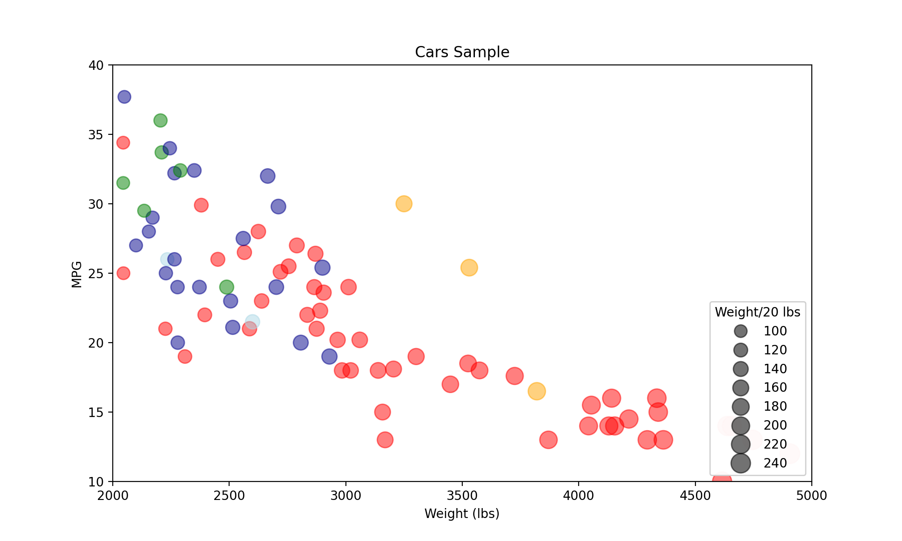

# 02-DataVis-5ways
- Write a paragraph for each visualization tool you use. What was easy? Difficult? Where could you see the tool being useful in the future? Did you have to use any hacks or data manipulation to get the right chart?

# p5.js
Processing is a software library that is used for drawing and teaching new programmers how to code. It has a number of implementations such as versions targeted at Java, JavaScript, and Python. I used the p5.js library for this project due to difficulties getting a Processing-like library working in Python 3 (the official version uses Jython as its runtime so it is still targeting Python 2.7). It also has an integrated editor/sketchbook that allows code to be easily shared online.

While the web editor was very easy to use and edit in (save for a lack of a Vim mode), the process of creating a scatter plot/bubble chart was very time consuming since there were no built-in libraries to do this, meaning some manual work had to be done in terms of data processing. While importing the data is relatively easy with the `loadStrings` function, most of the CSV parsing had to be done by hand which was made easier using higher order functions such as `Array.map()` to parse the lines one by one and do the necessary data conversions, which largely consisted of doing a group by operation using a dictionary by category to separate out the manufacturer time series. 

The plotting of the bubbles was relatively easy since Processing has a built in way to convert ranges of values to locations on the canvas (the function is coincidentally named `map()`). The main issue with plotting presented itself when having to figure out how to manually draw the grid lines and making sure that they were in scale with the data. The title, axis, and tick labels had to be drawn manually also using text drawing primitives, which was somewhat tedious compared to other libraries where this is already done. To get the y axis title in the correct orientation I had to learn how to to a transformation
to rotate the canvas in the right orientation to draw the text. Drawing the legend was a largely manual
process by careful positioning of text, ellipse, and rectangle primitives (with loops of course). I also added some interactivity as an extra, so you can mouse over the bubbles and get data associated with these points.

While I found this exercise in creating a bubble chart in p5 to be educational, I would not recommend this tool since it takes much more effort to make a simple bubble chart than other libraries and interactivity is much harder since rendered objects do not have any internal state or event handling, making interactivity somewhat difficult for more advanced tasks.

# R + ggplot2 + R Markdown
R is a commonly used programming language for visualization, ggplot2 being a popular library for R. I primarily based my code on the lecture notes, so it uses the geom_point() layer. Overall, it was very easy to use and had no issues with creating this bubble chart to the exact specifications (the whole visualization code is 3 lines of code).

# Matplotlib
Matplotlib is a Python library that is used for plotting and making charts similar to MATLAB's plotting libraries that are included in the language. The data processing for this library was involved was not trivial: I still had to do grouping on the data using a dictionary to plot the individual categories and do manual CSV parsing. However it was relatively easy to do the actual plottting of the graph: it was mostly just calling functions to set axis titles, specifying that a legend needed to be created, and plotting each category. The only difficulty that I had in this section was that I had to manually determine the size of each bubble which I scaled based on the range of all of the weights. I would recommend this tool since it does not require a lot of effort, the syntax is easy to follow, and it still gives control to the user if they need to.

## Technical Achievements
- **Proved P=NP**: Using a combination of...
- **Solved AI Forever**: ...

### Design Achievements
- **Re-vamped Apple's Design Philosophy**: As demonstrated in my colorscheme...
