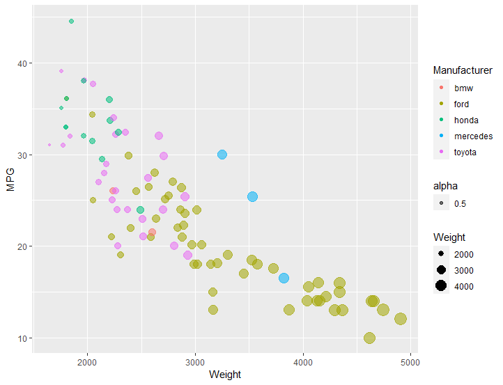
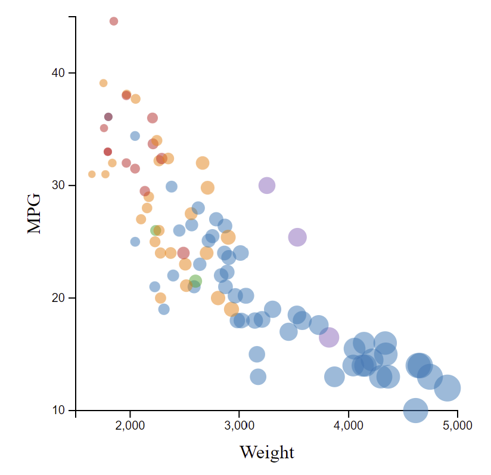
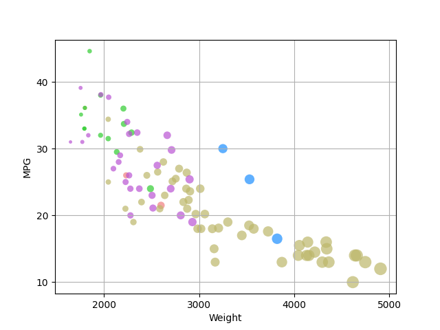
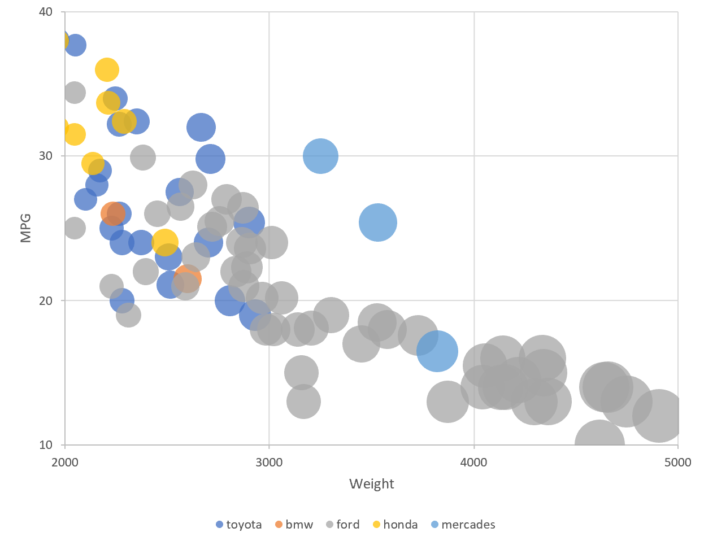
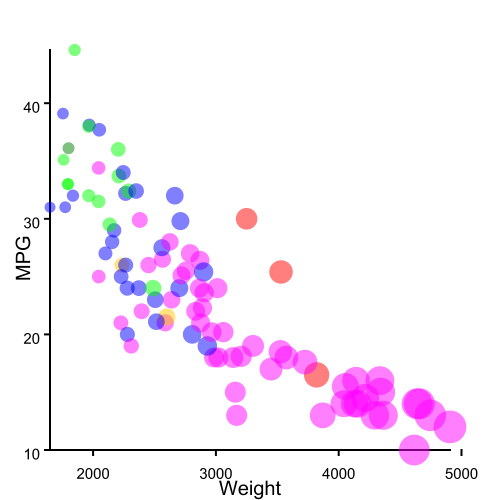

Assignment 2 - Data Visualization, 5 Ways  
===
Jasper Meggitt - jgmeggitt@wpi.edu

# ggplot
This was by far the easiest tool to use to quickly get a graph since it required minimal tweaking
once put into the basic tools. However, I would likely avoid this tool for more complex work since
the syntax used to manipulate the graph felt fairly unintuitive and would likely be far more
difficult to make small adjustments too manually.

# D3
For D3 I have a slightly compressed version of what was shown in class. Due to the flexibility of
JavaScript and being built on top of the SVG format, the tools were fairly intuitive to use and the
code looked quite clean once I had finished figuring out what exactly I needed to add to get the job
done.

# matplotlib
While matplotlib has a number of flaws, this was probably the most straightforward tool for me to
use. Since I have done a couple internships that involved a lot of matplotlib, this plot was fairly
quick and straightforward. This is generally my goto tool to use any time I need to make a more
complex plot that can not be done using the tools provided by excel.

# Excel
So far this was probably the most painful one to make. Searching for help online was extremely difficult due to the abundance of irrelivant guides for tangential topics. I found that I had to compromise with either having the ticks at the correct locations or having all of the data points within the axis bounds. Since the axis labels were an explicit requirement I decided to let some of the data get cut off.

# Java
This graph was fairly time-consuming, but generally straightforward. I was not sure what "Java 2d" referred to so I decided to try using Java Swing's graphics to build the graph. Unfortunatly, this approach was very manual like with D3, but without the added helper functions for making plots and diagrams. While I was a bit unsure which way I wanted to do it, I eventually decided to just write out the csv parsing the display manually. One issue I did run into though was how Java Swing is reluctant to do antialiasing on basic shapes. I found this a bit annoying due to how blocky the circles looked so I put together my own makeshift version of multisampling where I first drew the image to a large buffer then scaled it down.

## Technical Achievements
- **Multisampling**: Since the approach I used for the Java graph did not have a convenient way to
apply antialiasing to shapes, I instead used a makeshift form of multisampling instead. This involved
drawing everything larger by a certain factor to the first image, then using downscaling the image
in a final pass before saving it.

### Design Achievements
n/a
