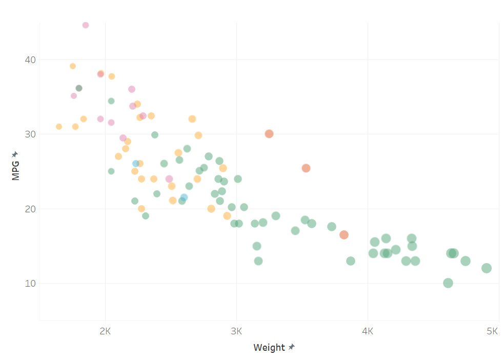

Assignment 2 - Data Visualization, 5 Ways  
===

# JS + d3

I used d3 to create this scatterplot in JavaScript. I am still pretty new to JavaScript, so this was a bit of a challenge, though the starter code helped greatly. I found that changing or adding things didn't always break the code - the scatterplot would still show up on my server, so it was sometimes hard to tell what exactly I had done wrong. Still, I think this tool will be very useful for me in the future for making data visualizations for websites. 

To remove the null datapoints that were appearing, I used an if/else statement, where the "if" caused the radius of the point to be 0 if the weight or MPG was null, and the "else" set the size according to weight otherwise. This worked, and though it seemed a bit hacky, I also figured it was the simplest way to do it. 

I also experimented with color and the mouseover tool, which I will explain futher in the technical and design achievement sections. 

# Python + matplotlib + seaborn + pandas

I used Python and a few statistical libraries to create this scatterplot. I use these libraries fairly often for my own projects, so this was not difficult. I used pandas to read the cars CSV file into a Pandas dataframe. Pandas is a data manipulation library that makes working with data very easy. I then used Seaborn to create the scatterplot from the dataframe. Seaborn is useful for making pretty visualizations from data. And finally, I used Matplotlib to create a legend and show the plot. I find Matplotlib the easiest library to use if I want to output an array as an image. 

# R + ggplot2 + R Markdown

For this visualization, I used R along with the library ggplot2. ggplot allowed me to create the scatterplot itself, and I used geom_point() to create the datapoints. The aes() function let me easily map the color to manufacturer and the size to weight. 

I've used R in the past, and am always impressed by how much it can do with so few lines of code, though there are so many libraries to learn. Overall, this was not particularly difficult. I may use R in the future, though I much prefer Python.

# Tableau

I created this plot in Tableau, which is a data visualization software. I've not used this tool before, but I found it very intuitive and I could immediately see the potential it has. It was very easy to make a visually pleasing scatterplot that fit the requirements - I didn't even have to check out a tutorial or documentation. I imagine that this tool will be fairly useful for me in the future, as many data science related job descriptions I see have Tableau as a desired tool to be familiar with. 

# Flourish

I created this plot in Flourish. Like Tableau, I hadn't used this tool before. I like the fact that it is a web-based and very accessible data visualization tool. I found it slightly more confusing than Flourish, but overall still simple to use. I think it's a nice way to quickly make a data visualization, though I'm more likely to use something like Tableau in the future if I'm working on a large project.

---

## Technical Achievements

For the technical achievement portion, I created a mouse over tool in my d3 visualization. When you mouse over a datapoint, it shows the weight and MPG as a coordinate pair beside the datapoint. This was a nice challenge, as it let me start learning how to create interactive visualizations in JS. It was also fairly simple, as I only really needed the JS documentation. 

## Design Achievements

For the design achievement portion, I experimented with colors and fonts in JS. I made the tooltip for the mouseover event more visually pleasing than the default. I also created my own color scheme instead of using d3 SchemeCategory10. I did this by creating an array of 5 hexadecimals and chose the colors using Google's built-in hex color picker. It took me some experimentation to get each color to be decipherable from each other while being visually pleasing, so it was a useful lesson. 
