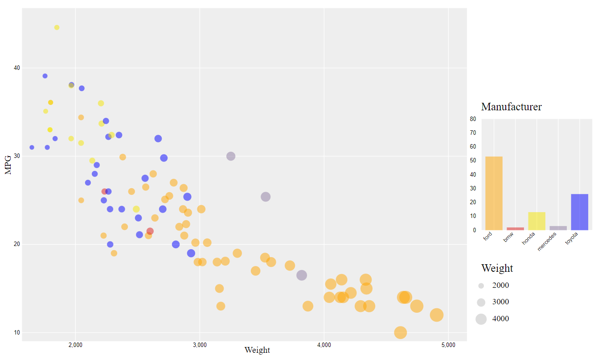
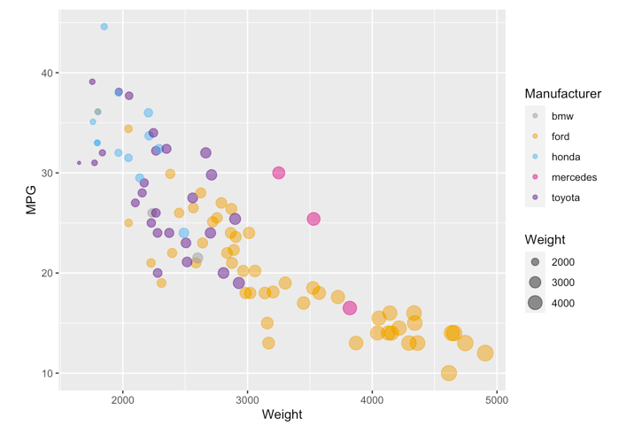

# 02-DataVis-5ways

Assignment 2 - Data Visualization, 5 Ways  
===

Now that you have successfully made a "visualization" of shapes and lines using d3, your next assignment is to successfully make a *actual visualization*... 5 times. 

The goal of this project is to gain experience with as many data visualization libraries, languages, and tools as possible.

I have provided a small dataset about cars, `cars-sample.csv`.
Each row contains a car and several variables about it, including miles-per-gallon, manufacturer, and more.

Your goal is to use 5 different tools to make the following chart:

These features should be preserved as much as possible in your replication:

- Data positioning: it should be a downward-trending scatterplot as shown.  Weight should be on the x-axis and MPG on the y-axis.
- Scales: Note the scales do not start at 0.
- Axis ticks and labels: both axes are labeled and there are tick marks at 10, 20, 30, etcetera.
- Color mapping to Manufacturer.
- Size mapping to Weight.
- Opacity of circles set to 0.5 or 50%.

Other features are not required. This includes:

- The background grid.
- The legends.

Note that some software packages will make it **impossible** to perfectly preserve the above requirements. 
Be sure to note where these do not support the features you need, but feel free to still use them.

Improvements to the chart and design are also welcome as part of Technical and Design achievements.

Libraries, Tools, Languages
---

You are required to use 5 different tools or libraries.
Of the 5 tools, you must use at least 3 libraries (libraries require code of some kind).
This could be `Python, R, Javascript`, or `Java, Javascript, Matlab` or any other combination.
Dedicated tools (i.e. Excel) do not count towards the language requirement.

Otherwise, you should seek tools and libraries like Excel, Tableau, or Flourish to fill out your 5.

Below are a few ideas. Do not limit yourself to this list!
Some may be difficult choices, like Matlab or SPSS, which require large installations, licenses, and occasionally difficult UIs.

I have marked a few that are strongly suggested.

- R + ggplot2 `<- definitely worth trying`
- Excel
- d3 `<- since the rest of the class uses this, we're requiring it`
- Matplotlib
- three.js `<- well, it's a 3d library. not really recommended, but could be interesting and fun`
- p5js `<- good for playing around. not really a chart lib but great for art and animation`
- Tableau
- Java 2d
- GNUplot
- Vega-lite <- `<- very cool formal language for visualization. might be the future of the field.`
- Flourish <- `<- popular in recent years`
- PowerBI
- SPSS

You may write everything from scratch, or start with demo programs from books or the web. 
If you do start with code that you found, please identify the source of the code in your README and, most importantly, make non-trivial changes to the code to make it your own so you really learn what you're doing. 

Tips
---

- If you're using d3, key to this assignment is knowing how to load data.
You will likely use the [`d3.json` or `d3.csv` functions](https://github.com/mbostock/d3/wiki/Requests) to load the data you found.
Beware that these functions are *asynchronous*, meaning it's possible to "build" an empty visualization before the data actually loads.

- *For web languages like d3* Don't forget to run a local webserver when you're debugging.
See this [ebook](http://chimera.labs.oreilly.com/books/1230000000345/ch04.html#_setting_up_a_web_server) if you're stuck.

Readme Requirements
---

A good readme with screenshots and structured documentation is required for this project. 
It should be possible to scroll through your readme to get an overview of all the tools and visualizations you produced.

- Each visualization should start with a top-level heading (e.g. `# d3`)
- Each visualization should include a screenshot. Put these in an `img` folder and link through the readme (markdown command: ``.
- Write a paragraph for each visualization tool you use. What was easy? Difficult? Where could you see the tool being useful in the future? Did you have to use any hacks or data manipulation to get the right chart?

Other Requirements
---

0. Your code should be forked from the GitHub repo.
1. Place available code, Excel sheets, etcetera in a named folder. For example, `r-ggplot, matlab, mathematica, excel` and so on.
2. Your writeup (readme.md in the repo) should also contain the following:

- Description of the Technical achievements you attempted with this visualization.
  - Some ideas include interaction, such as mousing over to see more detail about the point selected.
- Description of the Design achievements you attempted with this visualization.
  - Some ideas include consistent color choice, font choice, element size (e.g. the size of the circles).

GitHub Details
---

- Fork the GitHub Repository. You now have a copy associated with your username.
- Make changes to fulfill the project requirements. 
- To submit, make a [Pull Request](https://help.github.com/articles/using-pull-requests/) on the original repository.

Grading
---

Grades on a 120 point scale. 
24 points will be based on your Technical and Design achievements, as explained in your readme. 

Make sure you include the files necessary to reproduce your plots.
You should structure these in folders if helpful.
We will choose some at random to run and test.

**NOTE: THE BELOW IS A SAMPLE ENTRY TO GET YOU STARTED ON YOUR README. YOU MAY DELETE THE ABOVE.**

[Link to gh-pages](https://mchalmers.github.io/a2-DataVis-5ways/d3/index.html)

# D3

I started with D3 for this project. As a jumping off point I started with [This js graph example](https://github.com/stevemacn/D3-Vanilla-Template/blob/main/scatterplot.js)
This rudimentary graph was helpful to build off of. Reading in the values properly was very easy using d3.csv and it was even able to extrapolate the
names of each of the columns. After toying with the domains of both axes I was able to get the scaling correct which wasn't painful. Plotting the data
was also easy enough except for two rows which didn't have a MPG. Two values report NaN and my D3 decided they would be off the charts. I put in a catch
for any value that wasn't a number and then just make the radius of their circles 0 to hide them. I also maually set the color of each manufacturer. The
new colors I chose are easier for me to distinguish but they don't really correlate to the brands. But since every car brand is basically associated with
silver there isn't really a spesific (unique) color for each brand. Size and opacity were simple in D3 but outside of data changing things stylistically
tended to be tricky. Labeling the axis was alright once I figured out that the 'rotation transform' causes the 'translate transform' to behave differently.
Extending the tick marks created the proper grid, but I was unable to figure out a way to have only 4 labeled ticks but have 3 other smaller ticks between them.
Changing the color of the background was alright but changing the color of the grid was more hacky.

Overall, aside from the missing smaller interlaced grid lines the graph matches pretty perfectly.

# R + ggplot2 + R Markdown

R/ggplot2 was the original way this graph was made but even so, building a graph using this tool was VERY straightforward. 
It literally took one line to build the scatterplot after loading in the data and after working with aes to add the colors
and weight and alpha the graph looked just like the example. I did want to add my own color scheme that I had used in the d3
example and I needed to find away to not have the alpha legend auto generate. Scale_color_manual just had
to be appended onto the end which allowed me to spesify the colors. But there didn't seem to be an easy way to change the legends
that are auto generated by ggplot so I just added an alpha value to the custom colors "80" which is 0.5 of FF for the alpha chanel.

# Python + MatPlotLib + Pandas

MatPlotLib and Pandas in Python was able to read in and create a scatterplot of the cars sample data in just two lines. However this
initial graph didn't have many of the visual features from the ggplot graph. I was able to get the axis labled painlessly and the 
circle sizing was straigtforward however it doesn't seem to have the same level of variation from 2000 to 4000 as the others did even
though i've used the same formula. I was able to get the axis ticks to only show every other tick by itterating though and hiding half
of them which isn't too bad. The main problems with Matplotlib came from the colors. To change the background matplotlib apparently 
has a built in style for ggplot which would have made it look exactly like the example plot for me but I couldn't get it to work. So I 
changed the background and axies manually. The only thing left after that was to add the colors per manufacturer and add the legends.
This was unbelivibly tedious to try and set colors to strings because if the manufacturer data had been a number or a color then it would
have been able to update the graph automatically, however I couldn't find any way to specify a color of my choice for a given manufacturer.
To get around this I itterated though each value and added one point at a time checking the manufacturer to spesify the color to be added.
This does eventually create a nice graph with the correct colors but Python really doesn't seem to like it and the graph will lag when you
transform the window. In a symilar vein I just had to add a fake point with a label for each of the keys in the legend including the titles.

## Technical Achievements
- **Proved P=NP**: Using a combination of...
- **Solved AI Forever**: ...

### Design Achievements
- **Re-vamped Apple's Design Philosophy**: As demonstrated in my colorscheme...
