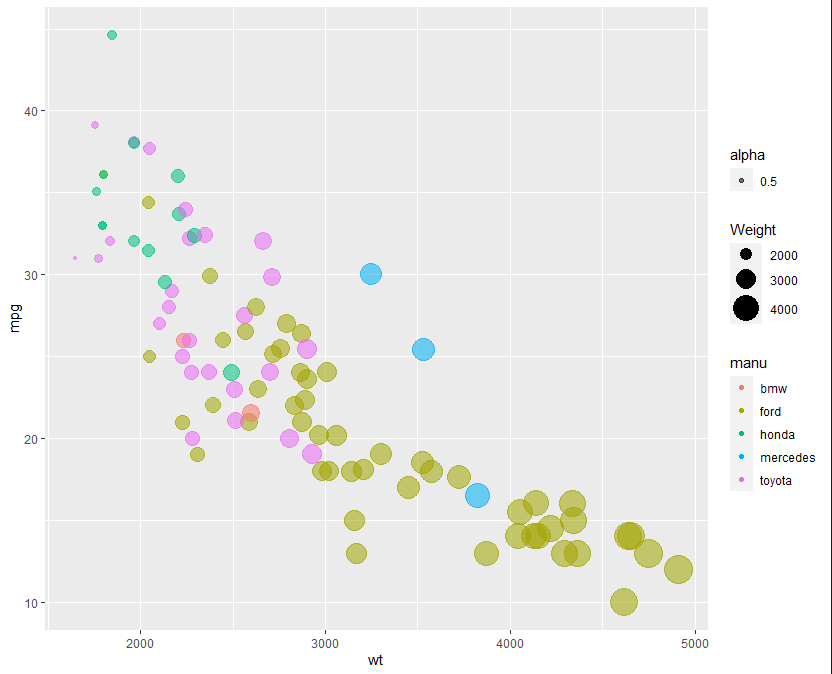
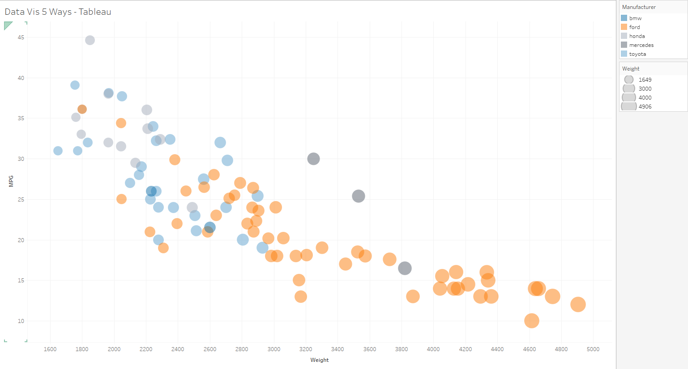

# R + ggplot2

I used the geom_point function from ggplot2 in r to create the points. The scale_size_coninuous function assists in setting the range of the scale for the weight points. 

This one was quite easy to produce since R has very accessible documentation and support for these finds of charts. R is quite useful if you want to make a standard chart of any kind and, since this was a pretty standard chart, no hacks or manipulation was needed. 

# Python + matplotlib

I used python and matplotlib + the seaborn extention to create the chart with a bit more style to it. This was pretty simple to create and required only one function call. This is similar to R in that simple charts can be done really easily. Again, nothing hacky and it was pretty straight forward.

# Excel

Excel was probably the hardest to get off the ground. Its easy to make something simple like a bar chart, but anything more custom requires a lot of messing around. For this, the hardest part was getting the colors to map to the manufacturer. To do this you have to make seperate columns for each catagory. I think a lot of previous knowledge is required to do many of the things in excel, but the resources are numerous yet hard to digest usually.

# Tableau

Tableau was extremely easy to do. I have a bit of previous experience in Tableau, so doing somthing simple like this was trivial. It does take a bit to find all of the features in the ui but the documentation is really good. Everything was pretty straight forward and no hacks needed. I did use Tableau prep to remove the missing/corrupted data.

# [d3](https://trumanlarson.github.io/a2-DataVis-5ways/d3/)

[Link here!](https://trumanlarson.github.io/a2-DataVis-5ways/d3/)

D3 is what I put most of my time into. It does take a bit to get started, even with the simple things, but it has so much potential for customization. I tried to take advantage of this as much as possible. I tried to keep it simple visually, but with interactivity to add extra clarity if the user wishes. 
  The base chart is fairly simple, but I added a hover capability that enables clearer data viewing. The most prominent aspect is the image of the manufacturer logo that appears in the place of the point. There are also lines that go out to the axis, with labels as to the values of the point. All of these are coordinated with color and ease of use. This is also where my technical and design achievements are. 

## Technical Achievements (all for d3 chart)
- **Logo showing on hover**: 
  - Used an image for each car logo that shows on hover
  - Cached the image data to make the hover more responsive. Putting the link directly into the svg image object would not cache on my browser, resulting in slow load time. Pre-loading this and storing the image data beforehand removed this problem. 
  - With the inclusion of the logo, it introduced layering issues where the mouse would mouse out when the logo appear. I solved these challenges with a very specific method of layering the images and raising them at particular points. This kept the hovering responsive
- **Dynamic visual elements**:
  - Created responsive labels and indicators that are dynamic in position and value
  - Most of the visual elements scale with the weight column of the point you are currently hovering on

## Design Achievements (all for d3 chart)
- **Visual reinforcement**:
  - The logo reinforcement the catagory of each point and connects it to its real world intepretation
  - The size of the logo and lines are scaled to reinforce the weight values of the point
  - The colors of the lines and labels are consistent with the point
- **Ease of reading**:
  - The user has access to the true values of each of the point through the labels
  - The user can use the lines to the axis to easily see how each point falls on the axis, and further contextualize the points with the values 

 
