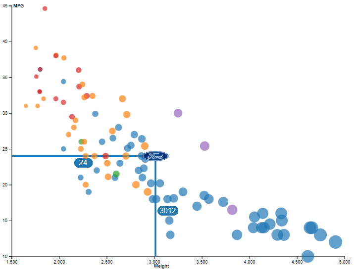

# 02-DataVis-5ways

## Alicia Howell-Munson

Assignment 2 - Data Visualization, 5 Ways  
===
- Write a paragraph for each visualization tool you use. What was easy? Difficult? Where could you see the tool being useful in the future? Did you have to use any hacks or data manipulation to get the right chart?

# R + ggplot2

I used the sample code from class as a boiler plate for my R implementation. This included using the library ggplot2 and the function `geom_point` which made it extremely simple to create the scatterplot. I looked up the documentation for R to check what other aesthetics I could modify besides the x axis, y axis, color, size, and opacity. Another simple aesthetic is the shape of each dot, which I mapped to the Origin. This way, the user can look at trends in weight and MPG that aren't just related to the manufacturer but also to the origin - i.e. they could check if all American cars have similar trends. Despite being open source, R is well documented and it was easy to find the geom_point function to check for other aesthetics. I did have difficulties importing the csv file from the directory I wanted, so the user may need to change their file path on line 4 if they do not have a path named `Github/a2-DataVis-5ways` that the source code is located in.

# d3

For d3, I also used the sample code from class. The most difficult part of d3, as a Windows user, is debugging it. I ended up using VizHub to load my code and debug. [This is a link](https://vizhub.com/allyziemage/47b25d95a385475eb40287958fb2ee29?edit=files&file=index.html) to my code there, incase the code in the folder does not load the same way. I struggled to find documentation or examples of how to change the size of the dots to be respective to the weight, but eventually realized the reason my screen was turning one shade of blue was because it was using the _exact_ value of the weight in the dataset. That means that the dots were each over 1,000 pixels, which is too large. I solved this by dividing all weights by a constant on 500, which then produced dots that did not consume the entire screen in an endless abyss of blue. 

# Matlab 

MATLAB was more complicated when it came to accurately reproducing the original scatterplot. I used the group scatterplot function `gscatter` in order to have the color correspond to the manufacturer, however, `gscatter` does not have an opacity parameter nor can the size of each individual dot be changed. To address these two requirements, I overlaid a second scatterplot using the `scatter` function which does have size and opacity parameters. I made the fill color of the dots for `scatter` white and had their size correlate to weight, then changed the opacity of the white dots to 0.5. Since all of the dots are mapped exactly in the same location as the `gscatter` dots, this faded the color of the `gscatter` dots to appear more pastel/transparent (though it is not truly transparent). Then, to allow the user to see the size of the white `scatter` plot, I added a black border. 

# Jasp 

Jasp is a statistical analysis tool similar to SPSS, but it is opensource. It was fairly simple to import the csv and set up the scatterplot, however it is extremely limited in options. The user cannot specify color or size for the dots, it can only be grayscale and the standard color. However, it is easy to find options of other analytical information to include, such as a trendline and a density graph for each axis. The x axis automatically started at 2,000 but the y axis started at 0 and there is no way to change that. 

# Excel

Excel was mildly complicated when it came to grouping the colors by manufacturer. I needed to pull each manufacturer into a separate column which either the weight or MPG value - I chose MPG. I used a conditional statement to check if the column manufacturer was equal to the row manufacturer, and if it was, it would transfer the MPG value to that location. This then gave me five manufacturer columns to plot for MPG and then another weight column. Luckily, each variable distributed itself to the correct axis without any manipulation from me. There was no clear way (or documentation I could easily find) to change the dot sizes to be equal to weight, but it was simple to add a trendline. It took more manual work to change the opacity of each manufacturer to 50% so it was more complex than other tools (which were one aesthetic/parameter to toggle) but it was at least an option, unlike in Jasp. 

# Technical Achievements
For Jasp and Excel, I included trendlines. For Jasp, there is an additional density chart for each axis, and then in R I added the aesthetic for shape to map to origin.