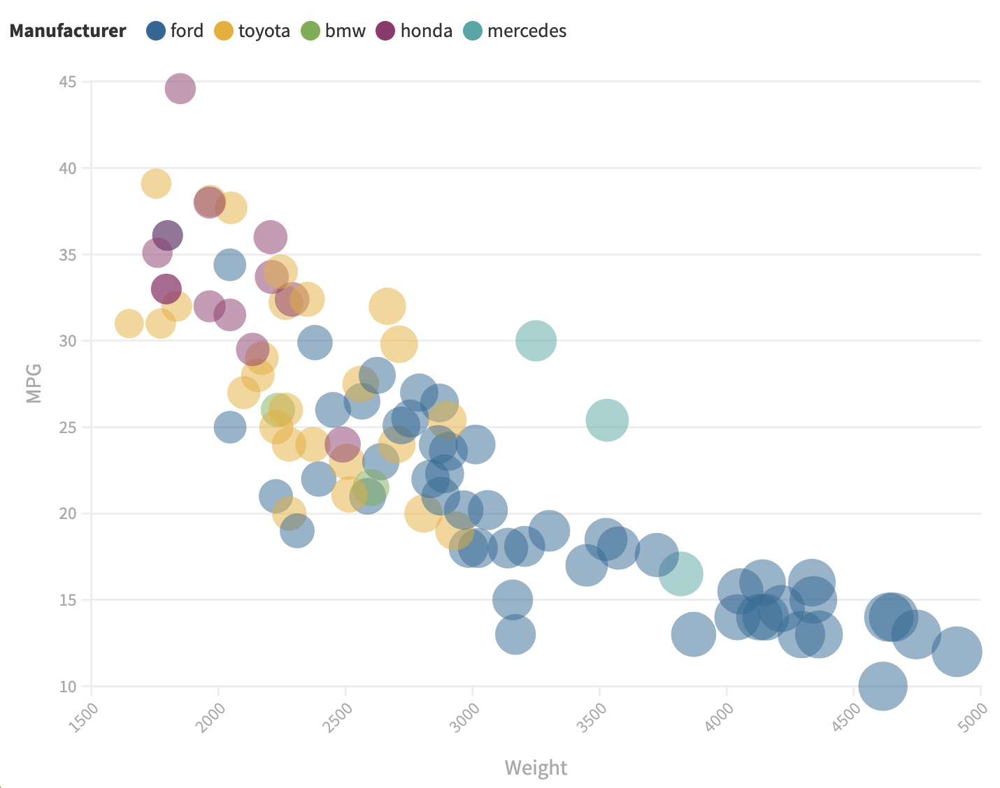

# Marcus Chalmers A2

To look at the D3 example: [Link to gh-pages](https://mchalmers.github.io/a2-DataVis-5ways/d3/index.html)

# D3

I started with D3 for this project. As a jumping-off point, I started with [This js graph example](https://github.com/stevemacn/D3-Vanilla-Template/blob/main/scatterplot.js)
This rudimentary graph was helpful to build off of. Reading in the values was very easy using d3.csv and it was even able to extrapolate the
names of each of the columns. After toying with the domains of both axes I was able to get the scaling correct which wasn't painful. Plotting the data
was also easy enough except for two rows that didn't have an MPG. Two values reported NaN and my D3 decided they would be off the charts. I put in a catch
for any value that wasn't a number and then just made the radius of their circles 0 to hide them. I also manually set the color of each manufacturer. The
new colors I chose are easier for me to distinguish but they don't correlate to the brands. But since every car brand is just associated with
silver there isn't a specific (unique) color for each brand. Size and opacity were simple in D3 but outside of data, changing things stylistically
tended to be tricky. Labeling the axes was alright once I figured out that the 'rotation transform' causes the 'translate transform' to behave differently.
Extending the tick marks created the proper grid, but I was unable to figure out a way to have only 4 labeled ticks but have 3 other smaller ticks between them.
Changing the color of the background was alright but changing the color of the grid was hackier. I decided to try and implement the smaller graph inside of the
legend to show the distribution of car brands instead of the standard legend for this example (See Achievements). 

Overall, aside from the missing smaller interlaced grid lines, the graph matches pretty perfectly.

# R + ggplot2 + R Markdown

R/ggplot2 was the original way this graph was made but even so, building a graph using this tool was VERY straightforward. 
It took one line to build the scatterplot after loading in the data and after working with 'aes' to add the colors
and weight and alpha the graph looked just like the example. I did want to add the color scheme that I had created in the d3
example and I needed to find a way to not have the alpha legend auto-generate. Scale_color_manual just had
to be appended onto the end which allowed me to specify the colors. But there didn't seem to be an easy way to change the legends
that are auto-generated by ggplot so I just added an alpha value to the custom colors "80" which is 0.5 of FF for the alpha channel.

# Python + MatPlotLib + Pandas

MatPlotLib and Pandas in Python were able to read in and create a scatterplot of the cars sample data in just two lines. However, this
initial graph didn't have many of the visual features from the ggplot graph. I was able to get the axes labeled painlessly and the 
circle sizing was straightforward however it doesn't seem to have the same level of variation from 2000 to 4000 as the others did even
though I used the same formula. I was able to get the axis ticks to only show every other tick by iterating through and hiding half
of them which isn't too bad. The main problems with MatPlotLib came from the colors. To change the background MatPlotLib  
has a built-in style for ggplot which would have made it look exactly like the example plot for me but I couldn't get it to work. So I 
changed the background and axes manually. The only thing left after that was to add the colors per manufacturer and add the legends.
It was unbelievably tedious to try and set colors to the strings. If the manufacturer data had been a number or a color then it would
have been able to update the graph automatically, however, I couldn't find any way to specify a color of my choice for a given manufacturer.
To get around this I iterated through each value and added one point at a time checking the manufacturer to specify the color to be added.
This does eventually create a nice graph with the correct colors but Python doesn't seem to like it and the graph will lag when you
transform the window. In a similar vein, I just had to add a fake point with a label for each of the keys in the legend including the titles.

# Flourish

Flourish is very straightforward to use and I was honestly very impressed. Most of the time when you can only use preset options to build
something you're always going to be limited in some way but for the most part, I was able to create everything painlessly. The data was easy
to upload and it automatically got rid of the two NaN values for me. It was easy to add my colors to the graph as well as change the background.
The only imitations I ran into were that I was unable to have intermediate tick marks on the axes and that I was only able to add one legend
which could only be placed on the bottom or top. Honestly with how much Flourish lets you do I'm surprised that I couldn't just put
a legend on the side of the graph. But other aspects let me customize to an insane amount, for example, this is the only tool aside from R
that has allowed me to specify that half the axes should have lines but no numbers.
Overall very straightforward. Also, I couldn't save any file but it's published publicly here: [Flourish Plot](https://public.flourish.studio/visualisation/8673630/)

# Excel

Excel was much more frustrating to use than I remember. Using the graph feature felt horribly out of date, I wouldn't be surprised if they haven't
updated the bubble/scatter plots since windows XP. Regardless I was able to get close to the original graph. After searching around I
was able to find areas to add all of my colors and the proper background. However, to do this I had to manually separate the data. Labels were as 
simple as typing text, the only issues were in the legend and axes. The legend wouldn't allow more than one again and I couldn't figure out how to
give it a title. The axes were frustrating because they would always start on the first value even if I set them to increase by 1000 and so I wasn't 
able to preserve the 2000,3000,4000... on either axis in favor of starting the graphs in the correct places. And once again I wasn't able to get
intermediate tick marks without labels. Finally, the NaN values defaulted to 0 which skewed the graph and so I just had to delete those data points.

# Google Sheets

Since I tend to use Google Sheets over Excel in smaller projects I've done in the past I wanted to do a 6th replication and compare the two.
Immediately it was much nicer to use google sheets and I  was able to get Google to recognize that each brand should be a separate color in
the bubble chart without having to manually separate the data. Setting the size was simple and all labels were easy to just type in. Moving on to
the stylization of the plot, I was able to add my colors again but there was no option to select only the background of the graph so I had
to color the entirety of the background light gray. Besides that, I was able to set up the axes and tick marks perfectly, something
that Excel couldn't even come close to. I was unable to label the legend for some reason even though there was an option to add a label that was 
grayed out for some reason. The one really big drawback that affects the readability of this plot is the fact that there was no option for
me to alter the size of the bubbles. They were standardized off the weights but They're far too big for the graph and there's no way for me to reduce
that besides manually changing the data values.
Overall it was much easier to make but because of the solid gray background and the inability to change the size of the bubbles it ended up
being one of the worst recreations.

## Technical Achievements
- **6 Replications**: Because I wanted to compare Excel and Google Sheets I made 6 different versions of the plot.
- **Background Grids & Legends**: In each tool, I made it a point to try and preserve all aspects of the plot, which included the background color, grids, and legends.
This ended up being the area where many tools differed in their ability, so it was a good thing to test.
- **Bar Graph Legend**: For the D3 example, I wanted to try and create a smaller graph inside of the legend like we had seen in one example in class.
Creating the bar graph axes was sort of similar to the scatterplot but wasn't too bad to set up. Most of the technical skills went into grouping and
counting the dataset for 'Manufacturer'. I realized I couldn't just read through the dataset, I had to transform the data to count the occurrences
of each brand to plot them accurately.

### Design Achievements
- **Color Choice**: I didn't care for the default color choice because I can't easily tell the difference between (Mercedes and Toyota) and (Honda and Ford).
I picked some colors that were pretty different although with the 50% opacity and gray background It was difficult to find 5 colors that looked starkly different.

I couldn't base the brand's colors off of colors they're typically associated with because like I said previously, they tend to be only silver or maybe some blue as well.
Either way, I can tell these colors apart, although the yellow and orange could stand to be a little further from each other.
- **Bar Graph Legend**: I took the idea from a visualization we saw in class where I believe the legend of the graph also had a smaller line graph that showed information about
the values being represented. I figured I could take that idea and create a bar graph showing the number of each type of car depending on the brand (see D3 example). I like
this idea in general because it adds more meaning to the legend. It still tells you everything you would otherwise need to know but the graph makes it feel like there's less
space being wasted.
